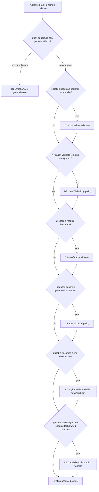

# Callable Type Decision Agenda — 2026-07-30

**Purpose:** Compose the callable-type decisions discovered while delivering inferred generics, preserve their primary-source research basis, and show their ordered implementation dependencies without replacing the owning feature SSOTs.

**Last updated:** 2026-07-31

## Authority Boundary

This document is a review aid, not a language SSOT. Durable authority remains
distributed across the linked feature documents. Approved and delivered
foundations are:

1. [Keyword-Free Lexical Contract](./features/core-keyword-free-lexical-contract.md)
2. [Inferred Callable Relation](./features/core-inferred-callable-relation.md)
3. [Recursive Callable Group](./features/core-recursive-callable-group.md)
4. [Context-Driven Call Instantiation](./features/core-context-driven-call-instantiation.md)

The language owner approved D1–D7 on 2026-07-31. Their owning feature documents
are now `accepted/converged`; this agenda records the approved composition,
while each feature SSOT owns its implemented boundary and evidence.

## Research Basis

Research was limited to language specifications, compiler documentation, and
primary papers. The relevant implementation lessons are:

| Reference | Useful implementation fact | Pitfall relevant to Styio |
|-----------|----------------------------|---------------------------|
| [Damas and Milner, “Principal type-schemes for functional programs”](https://doi.org/10.1145/582153.582176) | Definition-boundary generalization and fresh use-site instantiation provide a principled rank-1 baseline. | Adding ad-hoc overloading, effects, or higher-rank inference without a separate constraint system loses the simple principal-type property. |
| [OCaml: Polymorphism and its limitations](https://ocaml.org/manual/polymorphism.html) | OCaml separates generic from weak variables, applies a relaxed value restriction around mutation, and requires explicit support for polymorphic recursion and higher-rank uses. | Generalizing an effectful or mutable value as though it were pure can be unsound; unrestricted local and recursive polymorphism also makes inference less predictable. |
| [Haskell 2010 declarations and bindings](https://www.haskell.org/onlinereport/haskell2010/haskellch4.html) | Binding groups are inferred together; type-class constraints and default declarations resolve overloads that plain unification cannot. | Monomorphism and defaulting rules can make an apparently small binding depend on module-wide ambiguity resolution, with surprising behavior and performance. |
| [GHC let-generalisation](https://downloads.haskell.org/ghc/latest/docs/users_guide/exts/let_generalisation.html) | `MonoLocalBinds` generalizes a local group only when its free variables are closed, trading expressiveness for predictable inference. | Automatically generalizing captured local functions can leak environment variables into schemes or require annotations the source model did not plan for. |
| [GHC type-variable defaulting](https://downloads.haskell.org/ghc/latest/docs/users_guide/exts/type_defaulting.html) | Defaulting is an explicit final inference phase for otherwise undetermined metavariables. | Silent numeric or representation defaulting can change behavior and performance; it should not be mixed into ordinary unification. |
| [Swift type inference](https://docs.swift.org/swift-book/documentation/the-swift-programming-language/types/) and [empty collections](https://docs.swift.org/swift-book/documentation/the-swift-programming-language/collectiontypes/) | Type information flows both upward and downward within one expression; empty collections require contextual or explicit element types. | Unbounded whole-program back-propagation makes diagnostics unstable, while defaulting empty collections manufactures element types with no evidence. |
| [Rust E0282](https://doc.rust-lang.org/error_codes/E0282.html) | Rust rejects an unconstrained `Vec::new()` and asks for an annotation or explicit type argument. | Styio deliberately has no authored callable type arguments, so its only acceptable recovery is a concrete surrounding annotation. |
| [rustc mono-item collection](https://doc.rust-lang.org/stable/nightly-rustc/rustc_monomorphize/collector/index.html) | Rust constructs a reachability graph of concrete instances, supports lazy or eager collection, and may instantiate upstream generic bodies downstream. | One generic definition can produce zero to many artifacts; cross-module bodies, ownership, recursion limits, and incremental cache keys must be designed together. |
| [rustc codegen-unit partitioning](https://doc.rust-lang.org/nightly/nightly-rustc/rustc_monomorphize/partitioning/index.html) | Monomorphizations need deterministic placement and linkage to preserve incremental compilation. | Emitting the same specialization opportunistically in several units causes duplicate work, linkage ambiguity, or unstable rebuilds. |
| [Swift existential performance](https://docs.swift.org/compiler/documentation/diagnostics/existential-type/) | Type erasure uses containers and witness-table dispatch and can inhibit static optimization and require allocation. | Introducing boxed “any value” generic calls would conflict with Styio's current concrete LLVM types and no-GC generated-code boundary. |
| [OCaml compiler interfaces](https://ocaml.org/docs/compiler-frontend) | Compiled interfaces carry inferred type facts and hashes so separate compilation rejects inconsistent assumptions. | Publishing only a symbol name is insufficient for generic callers; scheme, body availability, ABI facts, and dependency hashes must remain coherent. |
| [C++ explicit instantiation](https://www.eel.is/c++draft/temp.explicit) and [points of instantiation](https://www.eel.is/c++draft/temp.point) | C++ specifies definition reachability, explicit-instantiation ownership, and point-of-instantiation rules. | Some inconsistent template meanings are ill-formed with no diagnostic required; Styio should avoid source-controlled instantiation points and make ownership deterministic. |
| [LLVM ORCv2](https://llvm.org/docs/ORCv2.html) | Symbol lookup can trigger lazy, dependency-aware materialization and concurrent compilation. | Lazy stubs can have a different address from the materialized target, so callable identity and function-pointer equality cannot be left implicit. |
| [Koka row-polymorphic effects](https://www.microsoft.com/en-us/research/wp-content/uploads/2016/02/koka-effects-2013.pdf) | HM-style type inference can be extended with inferred effect rows when effects are part of the formal type system. | Effect polymorphism is a system-wide semantic feature, not a flag that can safely be added only at generic-call lowering. |

## Styio-Specific Constraints

Styio should not copy any one language wholesale. Its current constraints point
to a narrower functional design:

1. Generic variables are compiler metadata; the keyword-free source language
   has neither authored binders nor call-site type arguments.
2. Ordinary calls are referentially transparent across instances. Inference
   order and the first observed call must never mutate the definition.
3. Resource, task, fallback, cleanup, and native operations carry effects and
   ownership obligations that plain HM equality cannot express.
4. Current LLVM lowering uses concrete value families and generated code does
   not gain a generic heap, witness-table runtime, or garbage collector.
5. The compiler already has a capability-oriented resource model. Future
   polymorphism should reuse capability/effect facts rather than introduce a
   parallel trait namespace.
6. Expected-type propagation stays expression-local. Empty containers and
   result-only variables may use a concrete surrounding annotation, but not
   distant later statements or module-wide guessing.

## Ordered Decision Tree

## Approved Owner Decisions

### D1 — Effect-aware generalization

Owning SSOT:
[Effect-Aware Callable Generalization](./features/core-effect-aware-callable-generalization.md)

Decision: **adopt the two-stage rule**. Treat resource access, task
operations, fallback/handler operations, mutation capture, and unclassified
native calls as non-generalizable until Sema owns an effect summary. This is
conservative like OCaml/GHC today, but leaves a deliberate Koka-style effect-row
extension instead of permanently tying polymorphism to syntax.

### D2 — Constrained callable relations

Owning SSOT:
[Constrained Callable Relations](./features/core-constrained-callable-relations.md)

Decision: **start with closed compiler-owned constraints** such as
numeric, comparable, indexable, iterable, and cloneable. Do not add source
instance declarations yet. This preserves coherence, avoids a keyword/typeclass
surface, and can reuse current capability facts. Open user instances require a
separate coherence and module-resolution decision.

### D3 — Ambiguous literals and empty collections

Owning SSOT:
[Ambiguous Literal Defaulting](./features/core-ambiguous-literal-defaulting.md)

Decision: **keep empty collections non-defaulting and context-required**.
For numeric literals, first normalize the scalar-width contract, then apply one
documented final defaulting phase; do not default during unification. Until
that prerequisite closes, ambiguous constrained calls should fail with a
surrounding-annotation diagnostic.

### D4 — Generic module-interface publication

Owning SSOT:
[Callable Interface Scheme Publication](./features/core-callable-interface-scheme-publication.md)

Decision: **publish the canonical scheme, effect/capability summary,
checked typed-body representation or equivalent reproducible body, and stable
dependency/ABI digests**. The defining module must validate the generic body
even when it has no local instances. Initially reject cross-module recursive
SCCs rather than making module compilation mutually dependent.

### D5 — Specialization ownership, cache, and budget

Owning SSOT:
[Callable Specialization Policy](./features/core-callable-specialization-policy.md)

Decision: **use lazy reachability for release artifacts, deterministic
single-owner placement, and content-addressed reuse**. Add a hard recursion
ceiling and a high safety ceiling for pathological instance growth, with a
diagnostic that prints the instance path. Gather telemetry before making a
normal code-size warning threshold part of the language contract. Do not expose
source-level explicit instantiation.

### D6 — Higher-order polymorphic callable values

Owning SSOT:
[Higher-Order Callable Polymorphism](./features/core-higher-order-callable-polymorphism.md)

Decision: **keep the accepted slice limited to direct named calls**.
Passing or storing a callable should first freeze one concrete monomorphic
function type. Reopen generalized callable values only after closure capture,
typed callable IR, effect summaries, and a deliberate higher-rank checking rule
exist.

### D7 — Resource/task/owned-handle polymorphism

Owning SSOT:
[Capability-Polymorphic Handles](./features/core-capability-polymorphic-handles.md)

Decision: **initially restrict generalized variables to plain immutable
value families and materialized pure collections**. Keep resources, streams,
tasks, and ownership-sensitive handles monomorphic until schemes can carry
capability, effect, send/sync, consume, and lifetime facts. Admit matrix
polymorphism only after element and shape constraints have one canonical type
representation.

## Dependency Order for Delivery

The smallest stable approval order is:

1. D1 and D2 independently.
2. D3 after D2.
3. D6 and D7 after D1 and D2.
4. D4 after D1, with D7's representation boundary recorded.
5. D5 after D4 establishes ownership and body availability.

Every item is approved, but a later item cannot converge before its required
delivery prerequisites. The syntax-feature gate derives blocked state from
these edges.

## Next Evolution Branches

The delivered D1–D7 boundaries expose later choices around callable values,
effect and capability polymorphism, open constraints, portable generic bodies,
persistent specialization reuse, and configurable defaulting. They are
researched and ordered, without being approved, in
[Callable Type Evolution Questions — 2026-07-31](./CALLABLE-TYPE-EVOLUTION-QUESTIONS-2026-07-31.md).
