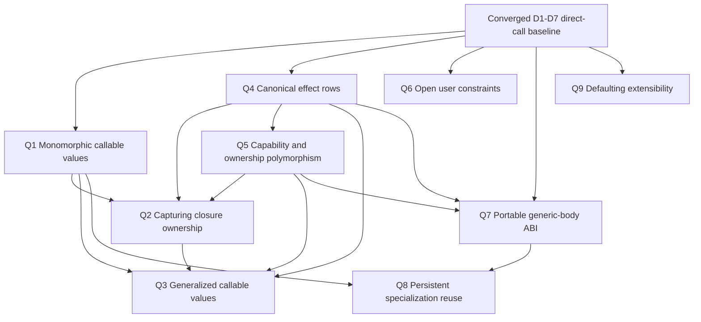
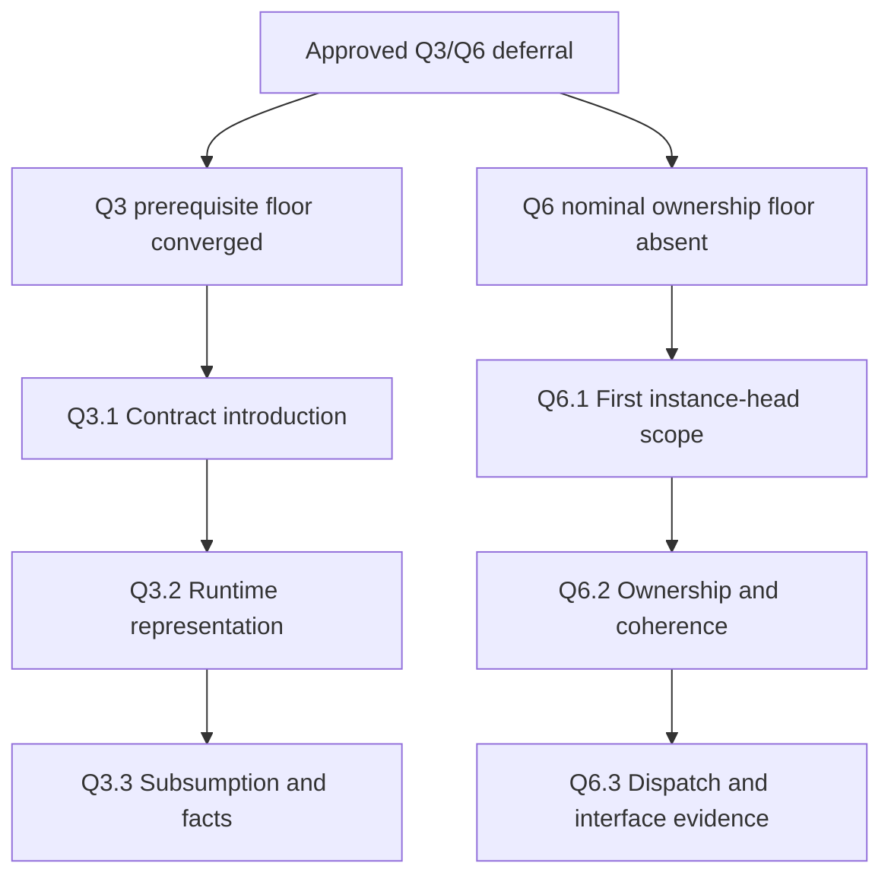

# Callable Type Evolution Questions — 2026-07-31

**Purpose:** Collect the still-undecided callable-type evolution branches found after D1–D7 converged, ground each branch in primary implementation evidence, and present one dependency-ordered batch of owner questions without becoming a language SSOT.

**Last updated:** 2026-07-31

## Authority Boundary

This document is a research-backed question set, not a syntax-feature SSOT.
The current callable-type features remain accepted and converged; none is
reopened by listing a future option here.

An owner answer has no implementation effect by itself. For every accepted
branch, the next change must create one durable child document under
[features/](./features/), declare its dependency and prerequisite edges, and
regenerate the syntax-feature graph. Deferred or rejected answers are recorded
in that child SSOT only when the owner chooses to make the resolution durable.

## Owner Resolution — 2026-07-31

The language owner approved the recommended Q1–Q9 batch:

| Question | Resolution | Owning feature SSOT |
|----------|------------|---------------------|
| Q1 | A — accept now | [Monomorphic Callable Values](./features/core-monomorphic-callable-values.md) |
| Q2 | A — accepted and converged for the affine program-static scalar boundary | [Affine Capturing Closures](./features/core-affine-capturing-closures.md) |
| Q3 | A — remain deferred after prerequisite convergence | [Rank-2 Callback Polymorphism](./features/core-rank2-callback-polymorphism.md) |
| Q4 | A — accept compiler/interface rows | [Canonical Effect Rows](./features/core-canonical-effect-rows.md) |
| Q5 | A — accept staged compiler-owned facts | [Capability and Usage Polymorphism](./features/core-capability-usage-polymorphism.md) |
| Q6 | A — defer open instances | [User-Extensible Callable Constraints](./features/core-user-extensible-callable-constraints.md) |
| Q7 | A — accepted; delivery floor met after Q4/Q5 convergence | [Portable Generic Body Interface](./features/core-portable-generic-body-interface.md) |
| Q8 | A — accept direction; delivery after Q7 | [Persistent Callable Specialization Cache](./features/core-persistent-callable-specialization-cache.md) |
| Q9 | A — fixed language defaults | [Fixed Inference Defaults](./features/core-fixed-inference-defaults.md) |

This table records the owner answer. Lifecycle state, implementation evidence,
and future evolution are authoritative only in the linked feature SSOTs.

The questions compose evolution boundaries from:

1. [Effect-Aware Callable Generalization](./features/core-effect-aware-callable-generalization.md)
2. [Constrained Callable Relations](./features/core-constrained-callable-relations.md)
3. [Ambiguous Literal Defaulting](./features/core-ambiguous-literal-defaulting.md)
4. [Callable Interface Scheme Publication](./features/core-callable-interface-scheme-publication.md)
5. [Callable Specialization Policy](./features/core-callable-specialization-policy.md)
6. [Higher-Order Callable Polymorphism](./features/core-higher-order-callable-polymorphism.md)
7. [Capability-Polymorphic Handles](./features/core-capability-polymorphic-handles.md)

## Research Method

Only language specifications, official compiler documentation, accepted
language-evolution proposals, and primary papers are used below. “Styio
consequence” is an inference from those sources and the repository's current
contracts; it is not a statement attributed to the cited project.

| Primary source | Implementation lesson | Pitfall and Styio consequence |
|----------------|-----------------------|-------------------------------|
| [Rust function-item types](https://doc.rust-lang.org/stable/reference/types/function-item.html) and [closure types](https://doc.rust-lang.org/stable/reference/types/closure.html) | A named function has a distinct, zero-sized item type and reaches a uniform function-pointer type only through contextual coercion. Capturing closures instead have anonymous environment types whose callable and transfer properties depend on use of captured values. | Treating every callable as one raw pointer erases capture, ownership, and call-count obligations. Styio should establish a noncapturing monomorphic boundary before representing captured environments. |
| [OCaml polymorphism and its limitations](https://ocaml.org/manual/polymorphism.html) | Weak variables, the value restriction, explicit polymorphic recursion, and explicit higher-rank annotations keep ordinary inference predictable. | Generalizing closures or inferring higher-rank values from ordinary application destroys the simple rank-1 contract and destabilizes diagnostics. Styio should keep higher-rank checking contextual and separate from direct-call inference. |
| [Koka row-polymorphic effect types](https://www.microsoft.com/en-us/research/wp-content/uploads/2016/02/koka-effects-2013.pdf) | Hindley–Milner-style inference can carry open effect rows; duplicate labels support principal unification and precise effect elimination. | An effect row is part of the callable relation, not a late Boolean purity flag. Styio must canonicalize effects in Sema and interfaces before effect-polymorphic callable values are admitted. |
| [Swift typed throws, SE-0413](https://github.com/swiftlang/swift-evolution/blob/main/proposals/0413-typed-throws.md) | A generic error parameter can propagate the exact effect of a closure argument through a higher-order operation. | Effect detail becomes API-resilience information and ripples to callers; compatibility exceptions can create soundness holes. Styio should not add source effect annotations that interface checking cannot verify. |
| [GHC linear types](https://downloads.haskell.org/ghc/9.10.1/docs/users_guide/exts/linear_types.html) | Multiplicity belongs to function arrows and may itself be polymorphic; binding, pattern, and lazy evaluation rules all participate. | Linearity cannot be bolted onto generic substitution after inference. Styio capability variables must carry use-count and consumption facts through schemes, captures, patterns, and topology checks. |
| [Swift noncopyable generics, SE-0427](https://github.com/swiftlang/swift-evolution/blob/main/proposals/0427-noncopyable-generics.md) | Swift made copyability an explicit generic requirement, retained a copyable default for existing code, and requires borrowing, consuming, or inout conventions for noncopyable parameters. | Relaxing a long-standing copy assumption affects generic containers, protocols, existentials, and ABI. Styio should stage handle polymorphism behind explicit compiler-owned usage facts instead of assuming that every inferred variable is freely duplicable. |
| [Rust trait coherence](https://doc.rust-lang.org/stable/reference/items/implementations.html#trait-implementation-coherence) | Overlap checks and the orphan rule prevent two dependencies from providing incompatible implementations for the same trait/type pair. | Open instances make dependency additions semantically observable and can invalidate separate compilation. Styio should not open its closed capability vocabulary until instance ownership and overlap are deterministic. |
| [OCaml compiler frontend](https://ocaml.org/docs/compiler-frontend) and [compiler backend](https://ocaml.org/docs/compiler-backend) | Stable compiled type interfaces and checksums are distinct from richer implementation metadata used for cross-module optimization. | One format should not make source compatibility depend on optional optimization material. Styio should keep stable callable schemes separate from a versioned, verifiable typed-body payload. |
| [rustc mono-item collection](https://doc.rust-lang.org/stable/nightly-rustc/rustc_monomorphize/collector/index.html) and [partitioning](https://doc.rust-lang.org/nightly/nightly-rustc/rustc_monomorphize/partitioning/index.html) | Concrete instances form a reachability graph, upstream generic bodies may be instantiated downstream, and deterministic placement matters for incremental reuse. | Persistent reuse is unsafe if a transitive body, interface, target, or ownership fact is absent from the identity. Styio's existing full content digest is the prerequisite, not the complete disk-cache policy. |
| [rustc incremental compilation](https://rustc-dev-guide.rust-lang.org/queries/incremental-compilation-in-detail.html) | Stable identities and fingerprints allow cross-session reuse, but hashing has real cost and cached results need promotion and dependency tracking. | A cache can regress clean builds or silently reuse stale work when identity is incomplete. Styio must measure lookup/hash cost and verify every reused artifact against its dependency digest. |
| [Clang ThinLTO](https://clang.llvm.org/docs/ThinLTO.html) | A compact summary enables parallel backends; persistent caching is opt-in and has explicit age, size, file-count, and pruning policies. | “Content-addressed” does not answer retention, corruption, concurrency, or remote-trust questions. Styio should start with a bounded local cache and make distributed reuse a separate security decision. |
| [GHC type-variable defaulting](https://downloads.haskell.org/ghc/latest/docs/users_guide/exts/type_defaulting.html) and [Swift collection types](https://docs.swift.org/swift-book/documentation/the-swift-programming-language/collectiontypes/) | Defaulting is a distinct final inference phase, while empty collections need contextual element types. | Module-configurable defaults make an identical expression change type with its import context. Styio should preserve fixed language defaults and context-required empty collections. |

## Styio Constraints Applied to Every Recommendation

1. Styio is keyword-free: words remain identifiers, and future syntax should
   reuse symbol-anchored families rather than add hidden keyword categories.
2. Definition-site rank-1 schemes and use-site instantiation are compiler
   metadata. There are no authored generic binders, `forall`, type arguments,
   trait dictionaries, or explicit instantiation points.
3. The functional default is immutable, but resources, tasks, handlers,
   capture lists, and mutable bindings carry observable effects and ownership.
4. The generated-code boundary currently has concrete LLVM value families and
   no generic heap, garbage collector, existential box, or witness-table ABI.
5. Resource topology already owns handle state and ordering. A generic feature
   must preserve those facts instead of routing handles through a parallel type
   universe.
6. Expected-type propagation remains expression-local. Later statements,
   unrelated imports, and first-observed calls cannot mutate an inferred
   relation.
7. Callable interfaces and specializations already fail closed on stale
   source, body, dependency, target, and ABI facts.

## Dependency Tree



This is an approval dependency tree, not a promise to deliver all branches.
Q1, Q4, and Q9 can be decided immediately. Q7's direction can be decided now,
but its portable typed-body implementation depends on typed callable/effect
facts. Q2, Q3, Q5, Q6, and Q8 should retain their dependency floors even if the
owner chooses their long-term direction in this batch.

## Question Set

### Q1 — What is the first concrete callable-value boundary?

**Question:** Should Styio admit named, noncapturing callables as first-class
monomorphic values before it admits captured closures?

Options:

- **A — Symbol-backed function item, recommended.** A bare final callable name
  has a compiler-owned function-item identity. It contextually coerces to a
  canonical monomorphic callable type such as `#(i64, i64): i64`; distinct
  definitions and concrete generic instances remain distinct until coercion.
- **B — Unified closure object immediately.** Every callable value uses one
  environment-plus-entry representation, including noncapturing functions.
- **C — Keep callable values unavailable.** Direct named calls remain the only
  callable use.

**Recommendation:** Approve A. It gives higher-order collection operations a
static, allocation-free baseline consistent with Styio's functional model and
current no-GC runtime. The exact `#(...): result` spelling must be validated in
the child grammar SSOT; it is a proposed symbol-anchored form, not active syntax
in this question set.

**Dependency/non-goal:** Requires the existing D6 boundary. It does not approve
captures, heap allocation, callable address equality, rank-2 values, or
impredicative storage.

### Q2 — How should capturing closures own their environments?

**Question:** Once Q1 exists, which closure-capture model should Styio adopt?

Options:

- **A — Derived affine environment, recommended.** Keep the existing explicit
  `$()` capture set; Sema derives shared-borrow, exclusive-borrow, or consume
  use from the body. Nonescaping environments may be stack/static. An escaping
  environment is allowed only when every capture has a deterministic owned
  representation and drop path.
- **B — Copy every environment.** Captures are copied into a uniform closure
  object whenever their concrete values are copyable.
- **C — Heap-box all escaping closures.** A runtime box owns captures and
  callable entry state.

**Recommendation:** Approve A as the direction, but keep delivery blocked on
Q1, Q4, and Q5. It reuses Styio's visible capture and resource-topology model,
does not add a hidden GC boundary, and makes illegal resource/task escape fail
before lowering.

**Dependency/non-goal:** Does not approve authored lifetime names, reference
counting, cyclic closure environments, or generalized capturing closures.

### Q3 — How far should callable-value polymorphism extend?

**Question:** After monomorphic values and owned captures exist, should a
callable value itself retain a generalized relation?

Options:

- **A — Context-checked rank-2 callbacks only, recommended long-term.** A
  higher-order parameter may require one internally generalized callable
  relation and check a named function against it bidirectionally. No source
  `forall` and no inferred impredicative containers.
- **B — Fully impredicative values.** Generalized callable values may appear in
  lists, dictionaries, fields, and arbitrary expression inference.
- **C — Permanently monomorphic callable values.** Generalization remains
  direct-call-only.

**Recommendation:** Defer A with a concrete reopen floor: Q1, Q2, Q4, and Q5
must converge first. A later child SSOT should start with callback parameters,
not polymorphic fields or containers. B is not recommended because ordinary
rank-1 inference cannot infer it predictably.

**Dependency/non-goal:** This question does not alter the current direct named
call behavior and does not introduce source generic binders.

### Q4 — Where should effect polymorphism become authoritative?

**Question:** Should Styio evolve its closed effect summary into canonical
effect rows, and if so, where should those rows be visible?

Options:

- **A — Compiler/interface rows first, recommended.** Schemes and `.styioi`
  metadata carry canonical closed rows and, for higher-order relations, an
  inferred open tail variable. Source keeps the existing operational handler
  surface; unclassified native calls remain `unknown` and non-generalizable.
- **B — Add source effect-row annotations now.** Users author effects and open
  effect variables on callable declarations.
- **C — Retain only the current closed bit summary.** Higher-order effect
  propagation is handled conservatively without row variables.

**Recommendation:** Approve A. It makes effect identity reproducible across
modules and supports functional higher-order operations without treating
purity as trust. Source-visible rows, native purity assertions, and handler
abstraction remain separate child decisions after compiler inference is
proven.

**Dependency/non-goal:** Extends D1 and D4. It must not change the source
meaning of the existing typed handler/evaluation operators.

### Q5 — Which capability facts may participate in generic schemes?

**Question:** How should resource, task, owned-handle, and matrix variables
eventually enter inferred relations?

Options:

- **A — Closed compiler-owned usage/capability facts, recommended.** Schemes
  may carry copy/borrow/consume, send/task-safety, resource state family, and
  materialized shape facts. Admission is per fact family and validated against
  resource topology at every concrete instance.
- **B — Generalize all concrete handles by representation.** Handles sharing
  an LLVM representation may substitute for one relation variable.
- **C — Keep every handle family permanently monomorphic.**

**Recommendation:** Approve A as a staged direction. Land affine
borrow/consume facts before generic resource methods; add task-transfer and
matrix-shape polymorphism as later child features with separate evidence. B is
unsafe because representation equality does not imply state, ownership, or
topology equivalence.

**Dependency/non-goal:** Requires Q4 for effect facts. It does not approve
authored lifetime variables, capability subtyping, generic resource methods,
or unconstrained shape arithmetic in the first child.

### Q6 — Should the closed constraint vocabulary become user-extensible?

**Question:** Should Styio add user-defined constraint/instance declarations
for inferred callable relations?

Options:

- **A — Defer open instances, recommended.** Keep numeric, comparable,
  indexable, iterable, and cloneable compiler-owned. Reopen only when nominal
  type ownership, module coherence, and instance naming have their own SSOTs.
- **B — Owner-local, non-overlapping instances.** An instance is legal only in
  the module that owns the constraint or the nominal type; orphan and
  overlapping instances are rejected, and associated types are separate.
- **C — Open/orphan instances with resolution priority.** Any module may add
  instances and priority selects among overlaps.

**Recommendation:** Choose A now and reserve B as the only researched reopen
direction. Styio's current capability vocabulary already covers the delivered
functional operators without a dictionary runtime. C would make import changes
alter type resolution and would undermine reproducible interfaces.

**Dependency/non-goal:** No constraint keyword or instance syntax should be
reserved by this answer. Specialization among instances and associated types
remain independent decisions.

### Q7 — What is the portable contract for downstream generic compilation?

**Question:** Should a published generic body become a versioned semantic
artifact independent of source parsing?

Options:

- **A — Stable scheme plus verified typed-body payload, recommended.** Keep the
  stable public relation/effect/capability contract separate from a versioned
  canonical typed StyioIR payload. Consumers verify schema, body, dependency,
  target-independent semantic, and compiler ABI digests before specializing.
- **B — Publish source text only.** Consumers parse and type-check the defining
  source with the consuming compiler.
- **C — Opaque binary generics.** Libraries publish no reproducible typed body;
  only prebuilt native instances are available.

**Recommendation:** Approve A as the long-term interface direction. Continue
rejecting cross-module recursive SCCs until a separate whole-program module
graph can establish one owner and one fixed point. Binary-only generic
libraries can exist only if they ship the verified semantic payload or restrict
themselves to an explicit finite concrete ABI in a later decision.

**Dependency/non-goal:** The current `.styioi` validation remains authoritative
until the child feature converges. This answer does not promise a stable native
generic ABI or cross-module mutual recursion.

### Q8 — How should specialization reuse persist across compiler invocations?

**Question:** After Q7, which cache and callable-identity policy should Styio
adopt?

Options:

- **A — Bounded local content cache, recommended.** Reuse verified native
  artifacts by the existing full specialization digest. Use atomic writes,
  compiler/target namespaces, corruption fallback, and explicit age/size/count
  pruning. Measure hash and lookup cost. Callable semantic identity remains its
  item/instance identity, never a process address.
- **B — Distributed shared cache immediately.** Machines exchange compiled
  artifacts by digest.
- **C — Keep session-local reuse only.**

**Recommendation:** Approve A only after Q7's typed-body verifier exists.
Distributed reuse needs a later trust/signature/provenance decision. Keep
source explicit instantiation and stable address equality rejected; profile
data may guide eager optimization but must not change program meaning.

**Dependency/non-goal:** Requires Q7. Link-unit ownership, dynamic loading,
function-address interop, and profile-guided warning thresholds remain separate
decisions.

### Q9 — May projects redefine inference defaults?

**Question:** Should users or modules be able to redefine numeric or collection
defaulting?

Options:

- **A — Fixed language defaults, recommended.** Preserve `i64` and `f64` as the
  only implicit scalar defaults, run defaulting once after solving, and require
  local concrete context for empty collections.
- **B — Module/project default declarations.** Imported or configured defaults
  select numeric representations.
- **C — Representation-polymorphic literals.** Literals remain unresolved until
  backend or overload selection.

**Recommendation:** Approve A as the durable boundary and reject B. A future
representation-polymorphic literal feature may be proposed only with an
explicit surrounding type/closed constraint; it must not turn backend choice
or import order into source semantics.

**Dependency/non-goal:** Does not prevent explicit scalar annotations or future
new numeric types. It prevents ambient configuration from changing an
otherwise identical expression.

## Recommended Batch Answer

The smallest coherent owner response is:

```text
Q1 A — accept now
Q2 A — accept direction; delivery blocked on Q1/Q4/Q5
Q3 A — defer until Q1/Q2/Q4/Q5 converge
Q4 A — accept now
Q5 A — accept staged direction after Q4
Q6 A — defer open instances; reserve owner-local coherence as reopen direction
Q7 A — accept direction; deliver after typed callable/effect/capability facts
Q8 A — accept direction; deliver after Q7
Q9 A — keep fixed defaults and reject module/project defaults
```

The approved answers are converted one feature at a time into the distributed
child SSOTs linked above. The question and research sections remain the
research record; this document never becomes the implementation state
registry.

## Deferred-Branch Research Refresh After Q1–Q9 Delivery

Q3 and Q6 remain deferred exactly as approved. This section does not reopen
either feature. It records the additional implementation evidence gathered
after Q1, Q2, Q4, Q5, Q7, and Q8 converged and turns the remaining ambiguity
into one later owner batch.

| Primary source | Implementation lesson | Pitfall and Styio consequence |
|----------------|-----------------------|-------------------------------|
| [GHC arbitrary-rank polymorphism](https://downloads.haskell.org/ghc/latest/docs/users_guide/exts/rank_polymorphism.html) and [Practical type inference for arbitrary-rank types](https://www.microsoft.com/en-us/research/publication/practical-type-inference-for-arbitrary-rank-types/) | Complete higher-rank inference is undecidable. GHC therefore receives a polymorphic expectation from an explicit or enclosing signature and checks the callback against that expectation. | Inferring universal quantification from a finite set of callback calls has no principal meaning. Styio should receive a nested scheme from an already-owned contract and use bidirectional checking; it should not guess rank from the body. |
| [GHC subsumption rules](https://downloads.haskell.org/ghc/latest/docs/users_guide/exts/rank_polymorphism.html#subsumption) | Shallow subsumption keeps quantifier placement exact. Optional deep subsumption inserts eta-expansion, and GHC documents that the rewrite can change evaluation semantics. | An implicit eta wrapper can also change Styio effect timing, affine capture lifetime, and specialization identity. The first callback slice should use shallow top-level scheme subsumption and never synthesize a closure to repair a mismatch. |
| [GHC impredicative polymorphism](https://downloads.haskell.org/ghc/latest/docs/users_guide/exts/impredicative_types.html) and [A quick look at impredicativity](https://www.microsoft.com/en-us/research/publication/a-quick-look-at-impredicativity/) | Production impredicative inference required a dedicated algorithm and explicit opt-in. Even that implementation keeps type-class constraints and instances monomorphic. | Rank-2 callback checking must not silently open polymorphic containers or higher-rank user constraints. Q3 and Q6 remain separate branches. |
| [OCaml polymorphism limitations](https://ocaml.org/manual/5.1/polymorphism.html) | OCaml requires explicit universal information for polymorphic recursion and higher-rank functions, and its value restriction prevents mutation/effects from receiving unsound generalization. | A mutable slot, effectful callback, or generalized capturing environment cannot become a rank-2 value merely because a higher-order call expects one. |
| [Rust higher-ranked trait bounds](https://doc.rust-lang.org/reference/trait-bounds.html#higher-ranked-trait-bounds) and [Scala 3 polymorphic function types](https://docs.scala-lang.org/scala3/reference/new-types/polymorphic-function-types.html) | Both expose the higher-rank boundary at the expected contract: Rust explicitly scopes higher-ranked lifetimes, while Scala explicitly distinguishes a polymorphic function value from an ordinary method or type lambda. | Mainstream implementations make rank visible rather than deriving it from ordinary applications. Because Styio has no authored generic binder, the first slice should prove interface/checker semantics before choosing a symbol-headed source form. |
| [Rust implementation coherence](https://doc.rust-lang.org/reference/items/implementations.html#trait-implementation-coherence) and [RFC 1023](https://rust-lang.github.io/rfcs/1023-rebalancing-coherence.html) | Orphan and overlap checks ensure one implementation for a trait/type pair. The RFC shows that instance-placement freedom is a zero-sum API-evolution budget and that later blanket implementations can be breaking changes. | Styio must establish nominal ownership before opening constraints and should begin with exact concrete heads, not blanket or structural instances. |
| [GHC instance resolution](https://downloads.haskell.org/ghc/latest/docs/users_guide/exts/instances.html) and [orphan modules](https://downloads.haskell.org/ghc/latest/docs/users_guide/separate_compilation.html#orphan-modules-and-instance-declarations) | Overlap, incoherence, recursive superclass solving, and orphan discovery complicate termination and force extra interface traversal during separate compilation. | Priority, incoherent overlap, recursive evidence, and ambient orphan discovery would undermine Styio's deterministic module graph and content-addressed specialization. |
| [Swift SE-0364](https://github.com/swiftlang/swift-evolution/blob/main/proposals/0364-retroactive-conformance-warning.md) | A conformance for a foreign protocol and foreign type can collide with a later owner conformance; Swift documents build failures and an indeterminate runtime winner before clients rebuild. | A warning or import priority is not a coherence model. Styio should reject foreign/foreign instances structurally and include the one selected owner-local instance identity in interfaces and specialization digests. |

### Styio-Specific Implementation Consequences

1. Q3 can use Styio's functional specialization model instead of introducing
   a polymorphic runtime closure ABI. A final noncapturing callable item can be
   a compile-time scheme witness; the enclosing higher-order callable is
   specialized by that item identity, and every demanded callback instance is
   emitted as an ordinary concrete specialization.
2. That model keeps generalized callback schemes as compiler metadata. No
   generic heap object, garbage collector, witness table, runtime type
   application, process address, or hidden type dictionary is required.
3. The callback item digest, nested required scheme, concrete demand set,
   effects, usage facts, portable bodies, and module dependencies must all
   participate in the enclosing specialization identity. Q7 and Q8 now provide
   the portable-body and persistent-object foundations for that rule.
4. The first rank-2 slice should be pure and noncapturing. Styio's existing
   rank-1 generalization admits only a closed empty effect row, and affine
   closure environments are monomorphic; neither invariant should be weakened
   implicitly by Q3.
5. Q6 should reuse the same static specialization path. A selected instance is
   canonical compile-time evidence whose named identity and implementation
   digest enter `.styioi` and the specialization key; it is not an ambient
   runtime dictionary.
6. Exact concrete instance heads permit an indexed
   `(constraint-id, nominal-type-id)` coherence map with deterministic duplicate
   rejection. Blanket heads, associated types, negative evidence, and
   specialization would require different overlap and termination machinery
   and therefore remain later branches.

## Queued Follow-up Question Set

**Owner status:** unanswered and intentionally queued. None of the options in
this section is active syntax or implementation authority. The linked Q3 and
Q6 feature SSOTs remain `deferred/not_started` until the owner answers this
batch and their remaining prerequisite documents converge.



### Q3.1 — Where may the first nested generalized callback contract originate?

Options:

- **A — Compiler/interface contract first, recommended.** Teach Sema,
  portable StyioIR, and `.styioi` to carry one nested generalized callback
  scheme supplied by a compiler-owned or standard-module contract. Ordinary
  source cannot author or infer that nested scheme yet; a later child decision
  selects a keyword-free symbol form after the checker and ABI are proven.
- **B — Select source syntax now.** Add a symbol-headed nested scheme form so
  source authors explicitly place and scope type variables without a `forall`
  word.
- **C — Infer rank from callback uses.** Promote a parameter to a generalized
  scheme when the enclosing body calls it at multiple types.

**Recommendation:** A. It gives the checker an unambiguous expected scheme and
preserves the approved no-authored-binder surface. C is rejected because two
or more finite calls do not determine one universal principal type. B should
follow executable interface evidence rather than coupling inference, syntax,
and runtime representation in one checkpoint.

### Q3.2 — How is a rank-2 callback represented during specialization?

Options:

- **A — Erased static scheme witness, recommended.** Admit only a final,
  noncapturing named callable item. Specialize the enclosing callable by the
  callback item's semantic identity, resolve every callback use to a concrete
  mono item, and omit the generic callback from the runtime ABI.
- **B — Uniform polymorphic closure object.** Pass an environment, entry
  point, and runtime type/evidence dispatcher.
- **C — Raw function pointer.** Pass one monomorphic address and reinterpret it
  at each callback use.

**Recommendation:** A. It is allocation-free, preserves parametric callable
identity, composes with Q7/Q8, and matches Styio's ahead-of-execution
specialization model. B requires a new heap and witness ABI. C is unsound
because one concrete address does not establish a generalized relation.

### Q3.3 — What is the first subsumption, effect, and storage boundary?

Options:

- **A — Shallow pure rank-2 only, recommended.** Quantify only ordinary data
  relation variables inside one callback parameter. Require a closed empty
  effect row, current admitted usage facts, exact quantifier placement, and
  shallow top-level scheme subsumption. Reject implicit eta-expansion,
  generalized captures, higher-rank results, and polymorphic containers.
- **B — Quantify effects and capabilities too.** Permit open effect tails,
  usage variables, affine environments, and implicit eta adaptation in the
  first slice.
- **C — General impredicative values.** Permit nested generalized schemes in
  results, fields, lists, dictionaries, and captures.

**Recommendation:** A. It preserves Styio's pure functional generalization
rule and makes the first implementation a bounded extension of the existing
scheme checker. B and C each require independent inference, representation,
and compatibility decisions.

### Q6.1 — What instance heads may the first open constraint admit?

Options:

- **A — Fully applied nominal concrete heads, recommended.** Keep Q6 blocked
  until nominal type ownership and callable member contracts converge, then
  admit only one user constraint applied to one fully known nominal head.
  Structural containers, blanket variables, conditional instances,
  associated types, and negative instances remain unavailable.
- **B — Structural and blanket heads immediately.** Permit instances over
  lists, dictionaries, callable shapes, and unconstrained type variables.
- **C — Open the current built-in scalar constraints first.** Let modules add
  implementations directly to `numeric`, `comparable`, or `indexable`.

**Recommendation:** A. It gives coherence an exact finite key and avoids
turning compiler-owned primitive semantics into an ambient extension point.

### Q6.2 — Which module owns an instance, and how is overlap resolved?

Options:

- **A — Constraint-or-head owner, no overlap, recommended.** An instance may
  be declared only in the module that owns the constraint or the outermost
  nominal head type. Reject foreign/foreign instances, duplicate canonical
  pairs, overlap, priority, and import-order selection.
- **B — Head-type owner only.** Only the nominal type's defining module may
  implement any constraint.
- **C — Explicitly imported orphans with priority.** Any module may publish an
  instance; imports and priority choose a winner.

**Recommendation:** A. The dependency DAG prevents two independent owners from
naming the same pair without one seeing the other's interface, while allowing
both constraint libraries and downstream nominal types to evolve. B is
coherent but needlessly prevents a constraint owner from supplying canonical
implementations. C recreates the collision and separate-compilation failures
documented by Rust, GHC, and Swift.

### Q6.3 — How is selected constraint evidence represented and published?

Options:

- **A — Named static instance evidence, recommended.** Give every instance a
  canonical `(constraint-id, nominal-type-id)` identity plus implementation
  digest. Publish it in the owning `.styioi`, resolve it before body
  specialization, direct-call its concrete operations, and include the
  identity/digest in dependent contracts and cache keys.
- **B — Runtime witness tables.** Pass method dictionaries through every
  constrained callable ABI.
- **C — Unnamed structural discovery.** Rediscover matching methods from all
  imported modules at each use.

**Recommendation:** A. It preserves deterministic compilation, makes stale
evidence fail closed, and does not add runtime dictionary allocation or
lookup. B may be reconsidered only if Styio later needs dynamic existential
dispatch. C makes imports semantically observable and cannot produce stable
content identities.

## Recommended Later Batch Answer

When the owner chooses to reopen these deferred branches, the smallest coherent
answer is:

```text
Q3.1 A — compiler/interface nested scheme first
Q3.2 A — erase a final noncapturing callable item as a static scheme witness
Q3.3 A — shallow pure rank-2 callback parameters only
Q6.1 A — fully applied nominal concrete instance heads only
Q6.2 A — constraint-or-head ownership with no orphan, overlap, or priority
Q6.3 A — named static instance evidence in interfaces and specialization keys
```

This recommendation is queued, not approved. After an owner answer, update
only the Q3 and Q6 feature SSOTs (or create separately approved prerequisite
feature SSOTs), regenerate the syntax-feature graph, and implement one
independently testable child at a time.
