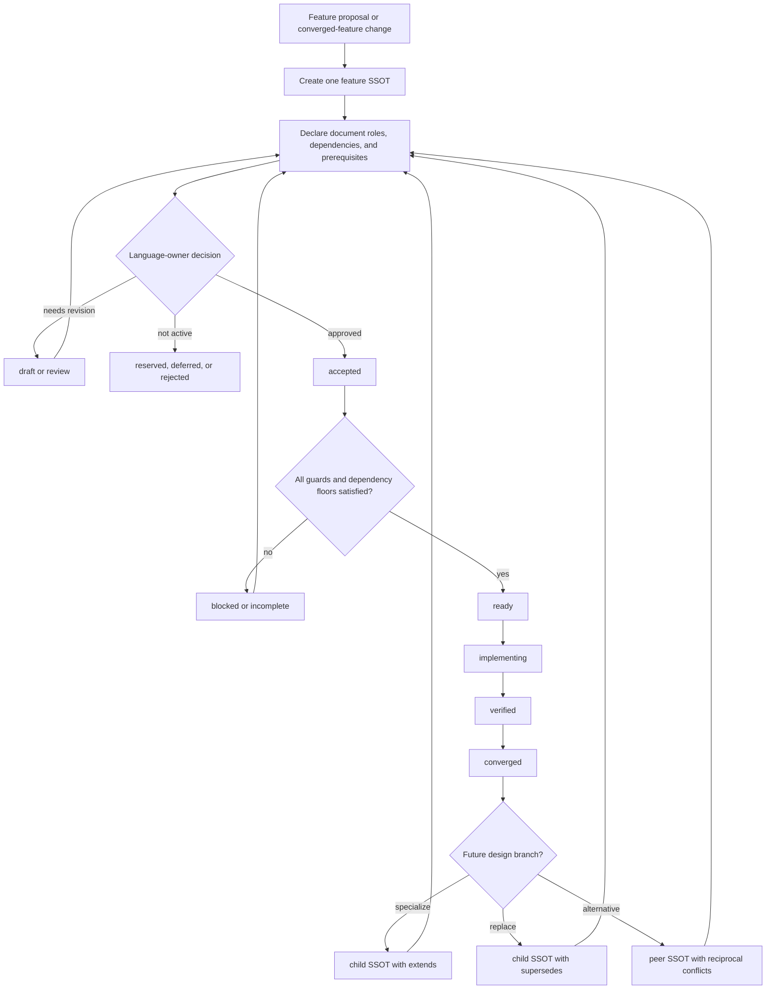

# Distributed Syntax Feature SSOT

**Purpose:** Define the vocabulary, document contract, lifecycle model, dependency relations, and maintenance rules for one-SSOT-per-feature Styio language development.

**Last updated:** 2026-07-30

Generated inventory lives in [INDEX.md](./INDEX.md).

## Ubiquitous Language

1. **Feature SSOT**: one Markdown document that owns one language feature's canonical surface, semantic boundary, dependencies, prerequisites, decision state, delivery state, and evidence map.
2. **Feature contract**: the single fenced `toml syntax-feature` block embedded in a feature SSOT. It exposes machine-readable facts without moving authority out of the document.
3. **Document role**: a referenced artifact class required to understand or deliver the feature: grammar, tokens, semantics, diagnostics, compatibility, teaching, implementation, or evidence.
4. **Dependency**: an edge from one feature SSOT to another feature SSOT.
5. **Prerequisite**: a named, evidenced guard that is not itself a feature, such as parser authority or owner approval.
6. **Decision state**: the durable human resolution: `draft`, `review`, `accepted`, `reserved`, `deferred`, `rejected`, or `superseded`.
7. **Delivery state**: implementation progress for an accepted decision: `not_started`, `implementing`, `verified`, or `converged`.
8. **Readiness**: the derived state `incomplete`, `blocked`, `ready`, or `stale`; maintainers do not author it directly.
9. **Composed view**: a generated index, graph, or compact map derived from feature SSOT documents. It is never a competing authority.

## Document Contract

Every feature SSOT must contain:

1. top-level `Purpose` and `Last updated` metadata;
2. exactly one fenced `toml syntax-feature` contract;
3. a decision statement and canonical or intentionally unavailable source form;
4. semantic, diagnostic, compatibility, dependency, prerequisite, and evolution boundaries;
5. implementation ownership and reproducible golden evidence when delivery has started.

Before delivery begins, the feature contract must name all eight document
roles. Draft and terminal branches may omit roles or delivery artifacts that
do not yet or no longer exist; the gate exposes those omissions as
`incomplete`, and delivery cannot advance. A role may reference a shared
cross-feature document, but the feature SSOT remains the maintenance entrypoint
and explains why that reference applies.

## Dependency Relations

1. `requires`: every target must reach the declared minimum decision and delivery state.
2. `requires_any`: at least one target in each requirement group must reach its declared minimum state.
3. `extends`: the feature specializes a converged feature and inherits its contract.
4. `conflicts`: a reciprocal relation; both features cannot be active simultaneously.
5. `supersedes`: the feature replaces another feature and must carry the migration decision. The replacement remains blocked until the target is `superseded`; every superseded target must have an accepted incoming replacement edge.
6. `after`: implementation ordering only; it does not imply semantic inheritance.

The directed `requires`, `requires_any`, `extends`, `supersedes`, and `after`
edges must be cycle-free. Conflict edges must be reciprocal.

## Prerequisite Guards

Every accepted feature must evidence these guards:

1. `language-owner-approval`;
2. `keyword-free-contract`;
3. `nightly-parser-authority`;
4. `grammar-contract`;
5. `semantic-contract`;
6. `diagnostic-boundary`;
7. `compatibility-decision`;
8. `golden-evidence`.

Feature-specific guards may be added when runtime, topology, ownership,
platform, migration, or ecosystem conditions are required.

## Lifecycle Guards

1. Non-accepted decisions must keep delivery at `not_started`.
2. Draft, review, reserved, deferred, rejected, and superseded documents may be incomplete or blocked while delivery remains `not_started`.
3. Accepted documents may remain `not_started` while dependencies are blocked.
4. `implementing`, `verified`, and `converged` require derived readiness `ready`.
5. Deferred features must name a concrete `reopen_when` condition.
6. A converged feature changes through a new decision edge; its old decision is not silently rewritten.
7. Dependency changes recalculate downstream readiness through the reverse dependency graph.

## Decision Tree

The tree is document-first: every durable branch is a feature SSOT, while the
state gate composes those documents into a directed acyclic graph.



`decision_state` records the human resolution, `readiness` is recomputed from
the document graph, and `delivery_state` records implementation progress.
Keeping these axes separate prevents implementation progress from silently
approving a language decision.

## Generated Projection

Run:

```bash
python3 scripts/syntax-feature-state-gate.py --write
python3 scripts/syntax-feature-state-gate.py
```

The first command regenerates `../SYNTAX-FEATURE-GRAPH.json`; the second proves
that feature documents, dependencies, prerequisites, implementation symbols,
golden cases, and the generated projection agree. Each generated feature entry
contains both its authored outgoing dependencies and derived `referenced_by`
edges so a change can enumerate every downstream document that needs
revalidation.
