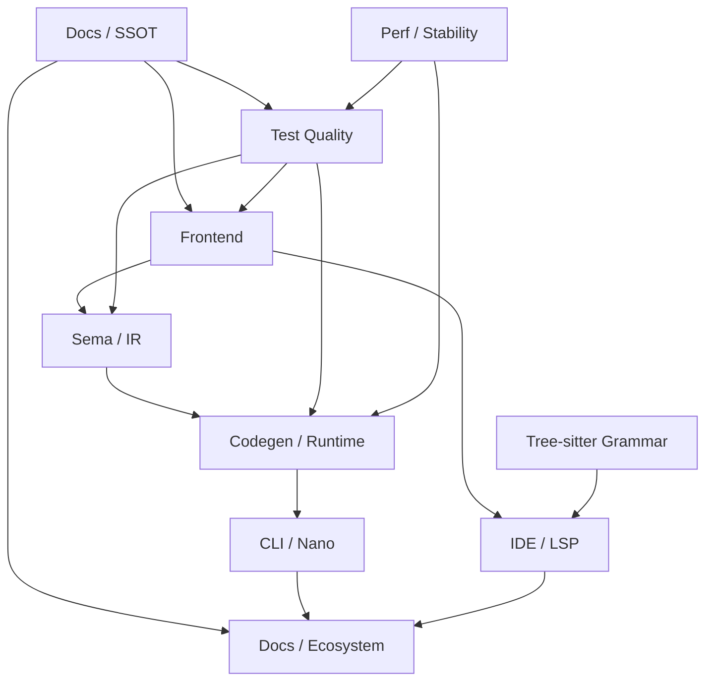

# Coordination Runbook

**Purpose:** Provide the daily coordination entrypoint for Styio maintainers and tech leads; this file routes ownership, review, escalation, checkpoint, and cutover decisions to existing SSOTs instead of redefining them.

**Last updated:** 2026-04-17

## Mission

The coordination owner keeps module ownership explicit, routes cross-team review, and prevents parallel truths from forming. This role does not override language semantics, accepted compiler behavior, or repository boundaries.

Authoritative references:

1. Language semantics: [../design/INDEX.md](../design/INDEX.md)
2. Project priorities: [../specs/PRINCIPLES-AND-OBJECTIVES.md](../specs/PRINCIPLES-AND-OBJECTIVES.md)
3. Repository boundaries: [../specs/REPOSITORY-MAP.md](../specs/REPOSITORY-MAP.md)
4. Test catalog: [../assets/workflow/TEST-CATALOG.md](../assets/workflow/TEST-CATALOG.md)
5. Checkpoint workflow: [../assets/workflow/CHECKPOINT-WORKFLOW.md](../assets/workflow/CHECKPOINT-WORKFLOW.md)
6. Cross-repo program plan: [../plans/Styio-Ecosystem-Delivery-Master-Plan.md](../plans/Styio-Ecosystem-Delivery-Master-Plan.md)
7. File-governance alignment plan: [../plans/Styio-Ecosystem-File-Governance-Alignment-Plan.md](../plans/Styio-Ecosystem-File-Governance-Alignment-Plan.md)

## Module Map

## Ownership Table

| Team | Primary runbook | Main surface | Required review trigger |
|------|-----------------|--------------|-------------------------|
| Frontend | [FRONTEND-RUNBOOK.md](./FRONTEND-RUNBOOK.md) | lexer, parser, Unicode, legacy route | Token, grammar, parser route, fallback, or parse diagnostic change |
| Sema / IR | [SEMA-IR-RUNBOOK.md](./SEMA-IR-RUNBOOK.md) | AST, type inference, lowering, IR, repr, session | AST lifecycle, type, IR shape, or golden repr change |
| Codegen / Runtime | [CODEGEN-RUNTIME-RUNBOOK.md](./CODEGEN-RUNTIME-RUNBOOK.md) | LLVM, JIT, externs, runtime helpers, handles | LLVM IR, runtime symbol, handle, memory, or error-code change |
| CLI / Nano | [CLI-NANO-RUNBOOK.md](./CLI-NANO-RUNBOOK.md) | CLI options, diagnostics, nano package workflow | CLI surface, machine-info, nano profile, package contract change |
| IDE / LSP | [IDE-LSP-RUNBOOK.md](./IDE-LSP-RUNBOOK.md) | IDE service, VFS, HIR, SemDB, LSP server | Public IDE API, LSP method, incremental edit, or semantic cache change |
| Grammar | [GRAMMAR-RUNBOOK.md](./GRAMMAR-RUNBOOK.md) | tree-sitter grammar and generated parser | `grammar.js`, generated CST surface, or syntax backend behavior change |
| Test Quality | [TEST-QUALITY-RUNBOOK.md](./TEST-QUALITY-RUNBOOK.md) | milestone, five-layer, security, fuzz, shadow gates | New feature, changed behavior, changed oracle, or regression sample |
| Perf / Stability | [PERF-STABILITY-RUNBOOK.md](./PERF-STABILITY-RUNBOOK.md) | benchmark, soak, perf route, regression reports | Hot path, allocation, runtime loop, benchmark matrix, or RSS threshold change |
| Docs / Ecosystem | [DOCS-ECOSYSTEM-RUNBOOK.md](./DOCS-ECOSYSTEM-RUNBOOK.md) | docs, templates, external handoff | SSOT, repo-boundary, generated index, archive, or ecosystem handoff change |

## Review Matrix

1. Parser behavior changes require Frontend, Test Quality, and Sema / IR review when AST shape changes.
2. Type or IR changes require Sema / IR, Codegen / Runtime, and Test Quality review.
3. Runtime handles, extern symbols, or JIT behavior require Codegen / Runtime, Perf / Stability, and Test Quality review.
4. CLI diagnostics or nano package changes require CLI / Nano and Docs / Ecosystem review; add Codegen / Runtime when runtime capability output changes.
5. IDE public API or LSP surface changes require IDE / LSP, Grammar when syntax behavior changes, and Docs / Ecosystem for `docs/external/for-ide/`.
6. Documentation structure changes require Docs / Ecosystem review and must preserve generated-index and audit gates.

## Escalation Rules

1. Language meaning conflict: use [../design/INDEX.md](../design/INDEX.md), then open or update [../review/Logic-Conflicts.md](../review/Logic-Conflicts.md) if unresolved.
2. Test acceptance conflict: use [../assets/workflow/TEST-CATALOG.md](../assets/workflow/TEST-CATALOG.md) and [../assets/workflow/FIVE-LAYER-PIPELINE.md](../assets/workflow/FIVE-LAYER-PIPELINE.md).
3. Repository ownership conflict: use [../specs/REPOSITORY-MAP.md](../specs/REPOSITORY-MAP.md).
4. Workflow or checkpoint conflict: use [../assets/workflow/CHECKPOINT-WORKFLOW.md](../assets/workflow/CHECKPOINT-WORKFLOW.md).
5. Priority conflict: use [../specs/PRINCIPLES-AND-OBJECTIVES.md](../specs/PRINCIPLES-AND-OBJECTIVES.md).

## Checkpoint Policy

Any high-risk cross-team work must stay checkpoint-sized:

1. Target a 1-3 day mergeable unit.
2. Ship code, tests, docs, ADR when needed, and `docs/history/YYYY-MM-DD.md` recovery notes together.
3. Keep fallback or shadow routes explicit when replacing parser, analyzer, runtime, CLI, or IDE behavior.
4. Update the affected team runbook before delivery whenever mapped owned files changed.
5. If a checkpoint changes cross-repo milestone IDs, repo exits, or shared cutover rules, update the authoritative ecosystem plan, mirror plans, and affected handoff docs in the same batch.
6. If a checkpoint changes docs tree topology, index-generation rules, archive/rollup lifecycle, ignore-policy baseline, or tracked-fixture negate rules, update the file-governance alignment plan and affected docs/runbook owners in the same batch.
7. Run the smallest team gate first, then `./scripts/delivery-gate.sh --mode checkpoint` for common delivery floor. Use `--mode push --base <ref>` before branch delivery. Keep `./scripts/checkpoint-health.sh` as the inner recovery gate.

## Release / Cutover Gates

The unified delivery floor is additive, not a replacement. Run `./scripts/delivery-gate.sh` first, then the cutover-specific minimum gate below.

| Cutover | Minimum gate |
|---------|--------------|
| Default parser route | Milestone tests, parser shadow gates, `parser_legacy_entry_audit`, relevant fuzz smoke |
| IR shape accepted by codegen | Five-layer cases for affected stages plus milestone or unit coverage |
| Runtime or handle contract | Security tests, soak smoke, relevant benchmark route |
| CLI diagnostic or exit-code contract | CLI-focused unit/milestone cases and docs update |
| Nano package contract | Nano tests in `styio_test`, [../external/for-spio/Styio-Nano-Spio-Coordination.md](../external/for-spio/Styio-Nano-Spio-Coordination.md) review |
| LSP or IDE API surface | `styio_ide_test`, [../external/for-ide/INDEX.md](../external/for-ide/INDEX.md) update, syntax grammar gate when applicable |
| Documentation collection shape | `./scripts/delivery-gate.sh --mode checkpoint --skip-health` |

## Handoff / Recovery

1. Every interrupted checkpoint records status, next step, reproduction commands, risks, and rollback point in `docs/history/YYYY-MM-DD.md`.
2. Link the owning team runbook and exact test command in the handoff note.
3. If the runbook changed, refresh [DOC-STATS.md](./DOC-STATS.md) in the same delivery.
4. If a team cannot finish a cross-team dependency inside the checkpoint, record it as a separate next checkpoint instead of leaving implicit work in comments.
