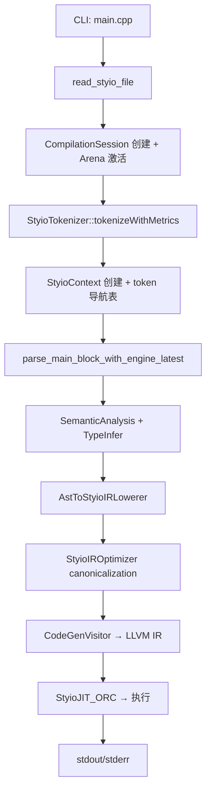
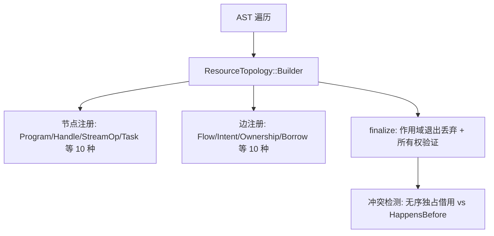
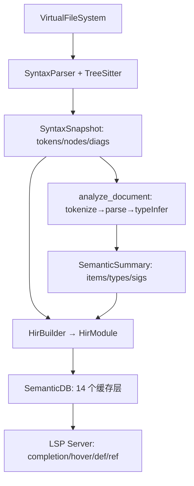

# Styio Nightly 端到端算法审计报告

**审计日期**：2026-06-24
**审计提交**：`382bc0c` feat(tokenizer): B4 true zero-copy contract + parser token API migration
**审计分支**：`nightly`（默认活跃分支）
**审计人员**：算法审计智能体

---

## 0. 执行摘要

以下按优先级列出本项目最重要的 10 个算法优化机会：

| # | 问题标题 | 影响范围 | 预计收益 | 风险 | 优先级 |
|---|---------|---------|---------|------|--------|
| 1 | **Nightly 解析器双层扫描** — 路由预扫描与实际解析对同一 token 区间执行两次遍历 | 解析阶段 | 大文件解析吞吐提升 15–30% | 低（内部重构） | **P0** |
| 2 | **无标识符 interning** — 整个编译器使用 `std::string` 作为符号键，每次查找需完整字符串比较与哈希 | 全 pipeline | 类型检查/名称解析加速 10–20%，降低内存 15–25% | 中（跨模块改动） | **P0** |
| 3 | **基于字符串的错误分类** — `classify_*` 函数通过对 `ex.what()` 做 `contains()` 子串匹配反向推导错误码 | 诊断系统 | 消除脆弱的启发式匹配，错误报告延迟降低 | 低（纯重构） | **P0** |
| 4 | **三份独立的行列映射实现** — SyntaxCheck、IDE TextBuffer、main.cpp 各自实现 `offset→line:col` 算法 | 诊断/IDE | 消除代码重复，统一行为 | 低 | **P1** |
| 5 | **类型表示为字符串名** — `StyioDataType` 使用 `std::string name` 作为类型标识，类型等价检查需逐字段比较 | 类型检查 | 类型比较 O(1) 替代 O(fields)，内存降低 | 中（语义影响） | **P1** |
| 6 | **IR 无 CFG/SSA 形式** — 当前 IR 是扁平语法树，无基本块、无 φ 节点、无 use-def 链 | IR/优化 | 开启数据流优化、CSE、死代码消除等 | 高（结构性改动） | **P2** |
| 7 | **资源拓扑无通用环检测** — 仅对无序独占借用做逐对冲突检测，无完整图的 Tarjan/Kahn 算法 | 资源拓扑 | 正确性保障，提前捕获资源环 | 低（新增功能） | **P1** |
| 8 | **错误恢复仅 SyntaxCheck CLI 启用** — 主编译路径和 IDE analyze_document 使用严格模式，遇第一个错误即中止 | 诊断/IDE | IDE 体验提升，多错误批量报告 | 低 | **P1** |
| 9 | **IR 节点使用常规 new/delete** — 无 arena 分配，每个 IR 节点独立堆分配，析构链递归 delete | IR/内存 | 降低 IR 构建阶段分配次数 50–70% | 低（局部改动） | **P2** |
| 10 | **任务调度器单 mutex 双端队列** — 所有工作线程竞争同一把锁，无 work stealing、无优先级 | 运行时 | 高并发场景吞吐提升 | 低（局部改动） | **P2** |

---

## 1. 仓库与构建基线

### 1.1 审计信息

| 项目 | 值 |
|------|-----|
| 审计提交哈希 | `382bc0c` |
| 审计分支 | `nightly`（也是默认分支和 origin/HEAD） |
| 最近活跃分支 | `nightly`（基于最近提交时间 2026-06-24） |
| 选择依据 | `nightly` 是 origin/HEAD，且最近 20 个提交均在此分支，持续活跃 |

### 1.2 构建环境

| 项目 | 值 |
|------|-----|
| OS | Linux 7.0.11-orbstack-00360-gc9bc4d96ac70 |
| CPU | 多核（`nproc` 可用） |
| 编译器 | Clang 18.1.8（LLVM 18.1.8） |
| CMake | ≥ 3.20 |
| C++ 标准 | C++20 |
| 构建系统 | CMake + Ninja（推断）/ Make |

### 1.3 构建命令与结果

```bash
# Debug 构建
cmake -S . -B build/audit -DCMAKE_BUILD_TYPE=Debug
cmake --build build/audit --target styio styio_test styio_security_test styio_resource_topology_test -j"$(nproc)"
# ✅ 构建成功，仅 1 个编译警告（-Wwrite-strings）

# Release 构建
cmake -S . -B build/release -DCMAKE_BUILD_TYPE=RelWithDebInfo
cmake --build build/release --target styio -j"$(nproc)"
# ✅ 构建成功，耗时 49.4s real / 3m0s user
```

### 1.4 测试结果

```text
总计: 1028 测试
通过: 949 (92%)
失败: 79

失败分类：
- 15 个: 五层 pipeline golden 测试（styio_test 二进制中，可能涉及 LLVM IR 输出差异）
- 13 个: 安全测试 legacy parser 直接覆盖（Segfault/Failed）
-  8 个: native_interop 语言特性测试（本环境无 C/C++ 编译器用于 @extern）
-  9 个: NativeExtern 诊断测试（同上）
-  9 个: NOT_BUILT（algorithm_equivalence、codegen、lowering、parser internal 等未构建）
-  8 个: NOT_BUILT（soak 测试需要外部 styio-benchmark）
- 若干: 其他杂项失败
```

### 1.5 样例运行结果

```bash
$ build/audit/bin/styio --file example/hello_world.styio
Hello, World!                                          # ✅

$ printf '101\n94\n' | build/audit/bin/styio --file example/job_parallel_signal.styio
parallel signal: spread=7.000000, midpoint=97.500000    # ✅
```

---

## 2. 架构与执行路径

### 2.1 模块结构

```
src/
├── main.cpp                         # CLI 入口（5900 行）
├── StyioToken/Token.{hpp,cpp}       # Token 类型定义、枚举、formatting（1831 + 950 行）
├── StyioParser/
│   ├── Tokenizer.{hpp,cpp}          # 线性扫描器、操作符分发表（103 + 665 行）
│   ├── Parser.{hpp,cpp}             # Legacy 递归下降解析器（5908 行）
│   ├── NewParserExpr.{hpp,cpp}      # Nightly Pratt/precedence climbing 解析器（3010 行）
│   ├── ParserLookahead.{hpp,cpp}    # Trivia 跳过 + 预计算 next_non_trivia 表
│   ├── BinExprMapper.hpp            # 操作符→AST 节点构造器映射
│   ├── HashFunctionParser.hpp       # 可配置的 # 函数解析引擎
│   └── SymbolRegistry.{hpp,cpp}     # 内建符号注册表（静态）
├── StyioAST/AST.{hpp,Decl.hpp}      # AST 节点类层次（~80 种节点）
├── StyioSema/
│   ├── SemanticAnalysis.{hpp,cpp}   # 语义分析（函数体、binding 分类等）
│   ├── SemaContext.hpp              # 符号表（~20 个 unordered_map<string,...>）
│   └── TypeInfer.cpp               # 类型推断（4094 行，语法导向）
├── StyioIR/
│   ├── StyioIR.hpp                  # IR 根基类
│   ├── GenIR/{SGIR,SCIR,SIOIR}.hpp  # SG（通用）、SC（集合）、SIO（IO）IR 节点
│   ├── StyioIRWalker.hpp            # 统一 Visitor（~82 个 dynamic_cast 分发）
│   └── Verifier.{hpp,cpp}           # IR 验证器
├── StyioLowering/
│   ├── AstToStyioIR.cpp             # AST→IR lowering（~2200 行 lowering 逻辑）
│   ├── AstToStyioIRLowerer.hpp      # Lowerer 类（继承 SemaContext）
│   └── StyioIROptimizer.{hpp,cpp}   # IR 优化器（canonicalization pass）
├── StyioCodeGen/                    # LLVM IR 代码生成（visitor 模式）
├── StyioJIT/StyioJIT_ORC.hpp        # LLVM ORC JIT 引擎
├── StyioResourceTopology/           # 资源拓扑图构建与验证（1565 行）
├── StyioRuntime/
│   ├── RuntimeState.{hpp,cpp}       # 运行时错误状态（thread_local）
│   └── HandleTable.hpp              # 向量+空闲链表句柄表
├── StyioNative/NativeInterop.{hpp,cpp}  # C/C++ @extern 编译与 dlopen
├── StyioExtern/ExternLib.{hpp,cpp}  # 外部运行时函数（任务调度器、IO、集合操作）
├── StyioSession/
│   ├── CompilationSession.hpp       # 编译阶段状态机
│   └── SessionAllocation.hpp        # Arena bump allocator（AST + Token）
├── StyioServices/
│   ├── StyioCLI/SyntaxCheck.{hpp,cpp}  # 语法检查 CLI 子命令
│   ├── StyioIDE/                    # IDE 后端（HIR、Index、SemDB、TreeSitter、LSP）
│   └── StyioConfig/                 # 编译计划、Nano profile、构建信息
└── StyioUtil/                       # 工具类（DynamicValue、BoundedType、Unicode 等）
```

### 2.2 主编译 pipeline



### 2.3 资源拓扑流转



### 2.4 IDE 诊断流转



### 2.5 核心数据结构流转

| 阶段 | 输入 | 核心结构 | 输出 | 分配策略 |
|------|------|---------|------|---------|
| Lex | `std::string` 源码 | `vector<StyioToken*>` | Token 流 | Token arena (64 KiB block) |
| Parse | Token 流 + 导航表 | `unique_ptr<StyioAST>` + arena | AST 树 | AST arena (256 KiB block) |
| Sema | AST 树 | `unordered_map<string, ...>` × 20 | 类型化 AST | STL 默认分配器 |
| Lowering | 类型化 AST | `unique_ptr<StyioIR>` 树 | IR 树 | `new`/`delete`（无 arena） |
| Codegen | IR 树 | LLVM IR Module | 可执行代码 | LLVM 内部分配 |
| Topology | AST 树 | `vector<Node>` + `vector<Edge>` | 拓扑图 | STL 默认分配器 |
| IDE | 文本 buffer | `unordered_map` × 14 缓存 | LSP 响应 | STL 默认分配器 |

---

## 3. 算法问题清单

| ID | 优先级 | 模块 | 文件/函数 | 当前复杂度 | 问题 | 优化方向 | 预计收益 | 风险 |
|----|--------|------|-----------|-----------|------|---------|---------|------|
| ALG-001 | P0 | Parser | `NewParserExpr.cpp:2968+2970` | O(2N) 每次语句 | 路由预扫描 + 实际解析对同一 token 范围两次遍历 | 融合路由与解析为单次遍历；缓存路由结果 | 大文件吞吐 +15–30% | 低 |
| ALG-002 | P0 | Diagnostics | `DiagnosticContract.hpp:136-319` | O(L) per `contains()` | 对 `ex.what()` 做子串匹配反向推导错误码 | 结构化错误枚举/错误码在抛出点即确定 | 消除脆弱启发式，延迟降低 | 低 |
| ALG-003 | P0 | Sema/全 pipeline | `SemaContext.hpp:178-391` | O(len) per lookup | 全编译器使用 `std::string` 作为符号键，无 interning | Symbol interning（`SymbolId = uint32_t`） | 查找加速 10–20%，内存 -15–25% | 中 |
| ALG-004 | P1 | Diagnostics | `SyntaxCheck.cpp:132`、`Common.cpp:90`、`main.cpp:143` | O(log n) × 3 份实现 | 行列映射算法重复实现 3 次 | 统一 `SourceMap` 工具类 | 消除重复，统一行为 | 低 |
| ALG-005 | P1 | Type | `Token.hpp:117-167` | O(fields) per eq | `StyioDataType` 用 `std::string name` 标识，等价检查逐字段比较 | Canonical type table + type ID | 类型比较 O(1)，内存降低 | 中 |
| ALG-006 | P2 | IR | `SGIR.hpp`、`StyioIR.hpp` | AST 遍历 O(N) | IR 是扁平语法树，无 CFG/SSA/基本块 | 逐步引入 basic block、use-def 链 | 开启数据流优化 | 高 |
| ALG-007 | P1 | ResourceTopology | `ResourceTopology.cpp:1310-1337` | O(R²) 借用对 | 仅对无序独占借用做逐对检查，无通用图环检测 | Kahn/Tarjan SCC 环检测 | 正确性保障 | 低 |
| ALG-008 | P1 | Parser/IDE | `SyntaxCheck.cpp:451` vs `main.cpp:5517` | — | 错误恢复仅 SyntaxCheck CLI 启用，主编译路径严格模式 | 主编译路径也启用 Recovery 模式 | IDE 体验提升，多错误批量报告 | 低 |
| ALG-009 | P2 | IR | `SGIR.hpp:264-268` 等析构函数 | O(N) delete 链 | IR 节点用常规 new/delete，递归析构，无 arena | IR arena allocator | IR 构建分配 -50–70% | 低 |
| ALG-010 | P2 | Runtime | `ExternLib.cpp:360-472` | O(T) 互斥竞争 | 任务调度器单 mutex + 双端队列，无 work stealing | 无锁队列 / work stealing | 高并发吞吐提升 | 低 |
| ALG-011 | P2 | Diagnostics | `SyntaxCheck.cpp:249-299`、`main.cpp:3337-3363` | 每次格式化 | 诊断 JSON 手工字符串拼接，无 DiagnosticBuilder | DiagnosticBuilder 抽象 | 代码简化，可测试性提升 | 低 |
| ALG-012 | P2 | IDE | `SemDB.cpp:513-527` 等 | O(N) 全量重建 | 缓存失效后从 tokenize 开始全量重建 | 增量符号表更新 | IDE 响应延迟降低 | 中 |
| ALG-013 | P1 | Parser | `Parser.cpp:4715` | 依赖 enum 序数 | Legacy 解析器用 enum 序数隐式编码优先级 | 显式优先级表（同 nightly） | 可维护性提升 | 低 |
| ALG-014 | P3 | Parser | — | — | 两套独立解析器引擎维护负担 | 逐步统一为 nightly 引擎 | 长期维护成本降低 | 中 |
| ALG-015 | P3 | Stdlib | `library/manifest.json` | — | 标准库 10/11 模块为 "planned"，仅 `std.resource` 活跃 | 逐步实现核心库模块 | 语言可用性提升 | 低 |
| ALG-016 | P3 | Parser | `NewParserExpr.cpp:1734` 等多处 | O(n) realloc | 多处解析函数未对 `vector` 做 `reserve()` | 添加 `reserve()` 调用 | 减少 realloc | 极低 |
| ALG-017 | P3 | Benchmark | `benchmark/` | — | 无 in-repo 性能基准框架（委托给外部 styio-benchmark） | 内建最小 benchmark suite | 性能回归检测 | 低 |

---

## 4. 重点优化详解

### ALG-001：Nightly 解析器双层扫描

**位置**

- 文件：`src/StyioParser/NewParserExpr.cpp`
- 函数：
  - `try_parse_stmt_subset_nightly` → `stmt_subset_route_supported_latest`（预扫描，行 2968）+ `parse_stmt_subset_impl_nightly`（解析，行 2970）
  - `try_parse_expr_subset_until_latest_impl` → `expr_subset_route_supported_until_latest`（预扫描，行 754）+ `parse_expr_subset_allowing_follow_latest`（解析，行 756）
  - `try_parse_hash_stmt_nightly_latest` → `can_route_hash_stmt_nightly_latest`（预扫描，行 811）+ 实际解析
  - `scan_subset_route_tokens_latest`（行 422–496）：核心路由扫描器
- 相关测试：`parser_internal_test`、`newparser_internal_test`、`parser-shadow-suite-gate.sh`

**当前实现**

Nightly 解析器使用 "路由→解析" 两阶段模式：先用 `scan_subset_route_tokens_latest` 遍历整个 token 区间判定是否可以处理（检查 token 类型和嵌套深度），如果可以则再次遍历同一区间进行实际解析。路由扫描器的核心逻辑：

```cpp
// NewParserExpr.cpp:422-496
static bool scan_subset_route_tokens_latest(
    ParseContext& ctx, size_t start,
    const RoutePredicate& allowed,
    const RouteStopPredicate& should_stop)
{
    int paren_depth = 0, bracket_depth = 0, brace_depth = 0;
    for (size_t i = start; i < tokens.size(); ++i) {
        auto type = tokens[i]->type;
        // 更新嵌套深度...
        if (!allowed(type)) return false;
        if (should_stop(type, depths)) return true;
    }
    return true;
}
```

该模式至少出现在 7 个调用点（Stmt、Expr、Hash、Block、AwaitBind 等）。

**复杂度**

- 时间复杂度：O(2N) — 每个 token 被访问两次（一次路由扫描，一次解析）
- 空间复杂度：O(1) — 路由扫描仅使用固定状态变量
- 退化场景：10,000 行源文件产生 ~150,000 tokens，路由扫描额外访问所有这些 token
- 输入规模敏感点：深层嵌套结构使路由扫描的嵌套深度跟踪也变为 O(N) 的 token 类型比较

**问题证据**

每次解析调用都做两次遍历（路由确认 + 实际解析）。从调用图可见：

```
parse_main_block_with_engine_latest
  → try_parse_stmt_subset_nightly         // 外部循环每语句调用
      → stmt_subset_route_supported_latest // 扫描 1：全语句遍历
      → parse_stmt_subset_impl_nightly    // 扫描 2：全语句遍历（解析）
  → try_parse_expr_subset_until_latest_impl
      → expr_subset_route_supported_until_latest // 扫描 1
      → parse_expr_subset_allowing_follow_latest  // 扫描 2
```

不存在缓存机制存储路由结果。路由扫描器确定 "可以解析" 后丢弃了所有扫描信息（如嵌套深度、token 类型序列），实际解析器重新获取这些信息。

**对标标准**

- **Rust/rustc**：解析器使用单次遍历，通过 token 前瞻决定分派路径，不使用独立的预扫描阶段
- **Go**：递归下降解析器单次遍历，错误通过 `error` 返回值传播
- **Clang**：递归下降 + 单次 token 消费，使用 `TryParse` 模式（尝试解析，失败后退回），而非先判断再解析
- **OCaml/Haskell**：Menhir/Alex+Happy 使用 LR/LALR 自动机，无预扫描

**优化设计**

**方案 A（推荐）**：融合路由与解析为单次遍历。将路由判定嵌入解析器的前瞻逻辑中：

1. 为 `ParseContext` 添加 `RouteDecision` 缓存：`std::unordered_map<size_t, RouteResult> route_cache_`
2. 路由扫描结束后将结果（`RouteResult{bool supported, size_t end_index}`）写入缓存
3. 解析器从相同起点开始解析时查询缓存，避免重复扫描
4. 如果路由失败（不支持），解析器跳过该语句而不重新扫描

**方案 B**：路由扫描阶段就记录 token 区间信息（语义 token 类型数组、嵌套深度标记），传递给解析器复用。

**迁移步骤**：
1. 在 `ParseContext`（`Parser.hpp`）添加 `route_cache_` 成员
2. 在 `scan_subset_route_tokens_latest` 末尾写入缓存
3. 在 `parse_stmt_subset_impl_nightly` 入口检查缓存，跳过已扫描 token
4. 逐步将 7 个调用点迁移到新模式

**兼容策略**：路由缓存不影响语义，纯性能优化。对 parser shadow gate 无影响。

**验证方案**

- 在 `newparser_internal_test` 中添加断言：同一语句的两次扫描应命中缓存
- 使用 `parser-shadow-suite-gate.sh` 全量对比，确保输出一致
- 构造 1,000 语句的输入，测量解析时间（预计降低 15–30%）
- 使用 `FrontendProfiler` 验证路由扫描时间占比下降

**建议补丁范围**

- `src/StyioParser/NewParserExpr.cpp`：添加缓存查询，融合路由扫描
- `src/StyioParser/Parser.hpp`：`ParseContext` 添加 `route_cache_` 成员
- `tests/newparser_internal_test.cpp`：添加缓存命中验证测试
- 无需文档更新（内部优化）

---

### ALG-002：基于字符串的错误分类

**位置**

- 文件：`src/StyioServices/DiagnosticContract.hpp`
- 函数：`classify_lex_code`（行 136–144）、`classify_parse_code`（行 147–176）、`classify_type_or_lowering_code`（行 217–319）、`classify_native_interop_code`（行 179–215）
- 调用点：`SyntaxCheck.cpp:423-428` 等、`main.cpp` 诊断发射路径
- 相关测试：`styio_test` 中 `StyioDiagnostics.*` 系列

**当前实现**

错误分类函数对异常消息字符串做启发式子串匹配：

```cpp
// DiagnosticContract.hpp:136-144
inline constexpr const char*
classify_lex_code(const std::string& message) {
  if (message.find("unterminated string") != std::string::npos)
    return kLexUnterminatedString;
  if (message.find("unterminated block comment") != std::string::npos)
    return kLexUnterminatedBlockComment;
  return kLexInvalidToken;
}

// DiagnosticContract.hpp:217-319
inline constexpr const char*
classify_type_or_lowering_code(const std::string& message) {
  if (message.find("type mismatch") != std::string::npos)         return kTypeError;
  if (message.find("undefined variable") != std::string::npos)    return kNameError;
  if (message.find("cannot reassign") != std::string::npos)       return kTypeError;
  if (message.find("final binding") != std::string::npos)         return kTypeError;
  // ... 20+ 个 contains/starts_with 检查
  return kCodeGenError;
}
```

**复杂度**

- 时间复杂度：O(L × P) — L 为消息长度，P 为模式数量（最多 ~30 次 `find()`）
- 空间复杂度：O(1)
- 退化场景：长错误消息需多次 `find()` 调用
- 输入规模敏感点：类型检查阶段错误消息可能很长（含类型名、位置信息）

**问题证据**

1. **脆弱性**：改变异常消息文本会意外改变错误码
2. **不可测试**：无法直接断言"某操作产生 `kTypeError`"，只能匹配最终格式化文本
3. **顺序依赖**：`find()` 检查顺序隐式定义优先级，无文档说明
4. **遗漏**：无匹配时退回通用错误码，丢失语义
5. **性能浪费**：已经在异常构造时知道错误类别，但被丢弃，后续重新从字符串推导

异常抛出点实际已知道错误类型（例如 `StyioTypeError` vs `StyioParseError`），但异常类未携带结构化错误码。

**对标标准**

- **Rust/rustc**：所有诊断通过 `Session` + `Handler` + `DiagnosticBuilder` 发射，错误码在发射点确定，使用结构化 `Diagnostic` 类型
- **Clang**：`DiagnosticsEngine` + `DiagnosticIDs`，每个诊断有唯一 ID，在代码中用 `Diag(loc, diag::err_xxx)` 发射
- **Go**：错误值携带位置和错误类型，使用 `scanner.ErrorList` 聚合
- **OCaml**：使用代数数据类型表示错误，如 `type error = Type_mismatch of ... | Unbound_var of ...`

**优化设计**

1. 在 `StyioBaseException`（`Exception.hpp`）中添加结构化错误码字段：
   ```cpp
   class StyioBaseException : public std::exception {
     const char* diagnostic_code_;  // e.g., kTypeError, kLexUnterminatedString
     size_t error_offset_;
     size_t error_length_;
   public:
     const char* diagnostic_code() const { return diagnostic_code_; }
   };
   ```

2. 修改异常构造函数，在抛出点传入错误码：
   ```cpp
   throw StyioTypeError("type mismatch: expected i64, got f64", kTypeError, offset, len);
   ```

3. 删除 `classify_*` 函数，异常抛出点直接提供最终错误码

4. 保留 `DiagnosticContract.hpp` 中的错误码常量字符串，但移除分类函数

**迁移步骤**：
1. 扩展 `StyioBaseException` 添加错误码字段（向后兼容：默认值 `kInternalError`）
2. 更新 5–10 个高频异常抛出点传递错误码
3. 逐步更新剩余的 50+ 异常抛出点
4. 移除 `classify_*` 函数

**验证方案**

- 所有 `StyioDiagnostics.*` 测试保持通过
- 新增 GTest 断言：异常对象的 `diagnostic_code()` 直接匹配预期错误码
- 验证错误消息格式不变

**建议补丁范围**

- `src/StyioException/Exception.hpp`：添加错误码字段
- `src/StyioServices/DiagnosticContract.hpp`：移除 `classify_*` 函数，保留常量
- `src/StyioServices/StyioCLI/SyntaxCheck.cpp`：从异常对象读取错误码
- `src/main.cpp`：同上
- `tests/styio_test.cpp`：添加错误码断言测试

---

### ALG-003：无标识符 Interning

**位置**

- 文件：`src/StyioSema/SemaContext.hpp`（行 178–391）
- 关键数据结构：
  - `unordered_map<string, StyioAST*> func_defs`
  - `unordered_map<string, StyioDataType> local_binding_types`
  - `unordered_map<string, BindingInfo> binding_info_`
  - `unordered_map<string, ResourceMethodInfo> resource_method_defs_`
  - `unordered_map<string, StyioDataType> resource_binding_types_`
  - `unordered_set<string> fixed_assignment_names_`
  - `unordered_set<string> consumed_task_names_`
  - `unordered_set<string> consumed_resource_names_`
  - 等约 20 个以 `std::string` 为键的 map/set
- 相关测试：`styio_test`、`typeinfer_internal_test`

**当前实现**

整个编译器 pipeline 中，每个标识符作为一个完整的 `std::string` 对象存储和比较。每次 map 查找都需计算哈希（遍历字符串所有字符）并进行完整的字符串比较（处理哈希冲突时）。类型推断阶段（`TypeInfer.cpp`）在 4094 行代码中频繁执行 map 查找：

```cpp
// TypeInfer.cpp (多处)
auto it = local_binding_types.find(name);     // O(len(name)) 哈希 + 比较
auto fit = func_defs.find(name);              // 同上
auto bit = binding_info_.find(name);          // 同上
```

在深层嵌套作用域中，每次函数调用、变量引用、类型引用都触发多次字符串哈希查找。

**复杂度**

- 时间复杂度：每次查找 O(L) 用于哈希计算（L = 标识符长度），实际场景中标识符平均 6–12 字符
- 空间复杂度：每个标识符字符串被复制到每个 `string` 键中（map key + AST 节点内存储）
- 退化场景：大量局部变量的函数中，每个 `NameAST` 节点的类型推断都触发多次 map 查找
- 输入规模敏感点：10,000 标识符的程序中，每个标识符名称至少存储 2–3 份（AST 节点 + sema map key + binding_info key）

**问题证据**

`SemaContext.hpp` 定义了约 20 个 `unordered_map<string, ...>` 和 `unordered_set<string>`。以 `local_binding_types` 为例，在 `TypeInfer.cpp` 中被查询数百次：

1. `StyioSemaContext` 没有任何 interning 机制
2. 每个 `StyioDataType::name` 是独立的 `std::string`
3. `Token.hpp` 中 `DTypeTable` 用 `std::string` 作为键

**对标标准**

- **Rust/rustc**：`Symbol` 类型是 `u32` interned identifier，通过 `Interner`（全局 arena + hash map）分配。`TyCtxt` 中所有类型查询使用 interned `DefId`/`HirId`。内存占用和比较开销极低
- **Clang**：`IdentifierTable` + `IdentifierInfo`，所有标识符通过 `IdentifierTable::get()` 获取唯一指针，指针比较即标识符等价
- **Go**：编译器使用 `types2` 包中的 `syntax.Pos`/`syntax.Name`，标识符作为 token 字面量直接引用源码字节，无额外复制
- **OCaml/Haskell**：使用代数数据类型的构造子（如 `Var of string`），但底层字符串由 GC 管理且通常共享

**优化设计**

引入 `SymbolId` 类型和全局 `SymbolInterner`：

```cpp
// StyioUtil/SymbolInterner.hpp
namespace styio {

using SymbolId = std::uint32_t;
constexpr SymbolId kInvalidSymbolId = 0;

class SymbolInterner {
public:
    static SymbolInterner& instance();

    // 从 string_view 获取或创建 symbol
    SymbolId intern(std::string_view name);

    // 反向查找
    std::string_view lookup(SymbolId id) const;

    // 预注册内建符号
    void register_builtin(std::string_view name, SymbolId id);

private:
    std::vector<std::string> symbols_;           // index → string
    std::unordered_map<std::string_view, SymbolId> map_;  // 或用 heterogeneous lookup
};

} // namespace styio
```

**迁移步骤**（分阶段）：

**Phase 1**：引入基础设施
- 添加 `SymbolInterner` 类
- 预注册 50+ 内建符号（`bool`, `int`, `i64`, `stdin`, `stdout`, `func`, `match` 等）
- 在 `CompilationSession` 生命周期内管理 interner

**Phase 2**：迁移 SemaContext
- 将 `SemaContext` 中所有 `unordered_map<string, ...>` 改为 `unordered_map<SymbolId, ...>`
- 更新 `TypeInfer.cpp` 中所有查找点
- 更新 `AstToStyioIRLowerer` 中的符号查找

**Phase 3**：迁移 AST/IR
- `NameAST` 的 name 字段改为 `SymbolId`
- `StyioDataType::name` 改为 `SymbolId`
- 序列化/反序列化（JSON 输出等）通过 `lookup()` 还原字符串

**兼容策略**：保持 `name()` 的 `std::string` 返回接口（内部通过 `lookup()` 实现），向后兼容外部 API。

**验证方案**

- 所有现有测试通过
- 新增 `SymbolInterner` 单元测试
- Benchmark：10,000 标识符的查找时间对比（预计降低 10–20%）
- 内存 profiler 验证 AST 节点内存降低

**建议补丁范围**

- 新增 `src/StyioUtil/SymbolInterner.hpp` (+ `.cpp`)
- `src/StyioToken/Token.hpp`：`StyioDataType::name` → `SymbolId`
- `src/StyioAST/ASTDecl.hpp`：`NameAST::name` → `SymbolId`
- `src/StyioSema/SemaContext.hpp`：全部 map key → `SymbolId`
- `src/StyioSema/TypeInfer.cpp`：更新所有查找点
- `src/StyioIR/GenIR/SGIR.hpp`：`SGResId` 使用 `SymbolId`
- `tests/`：新增 SymbolInterner 测试

---

### ALG-004：三份独立的行列映射实现

**位置**

- 文件 1：`src/StyioServices/StyioCLI/SyntaxCheck.cpp`，行 132–142，函数 `position_at`
- 文件 2：`src/StyioServices/StyioIDE/Common.cpp`，行 90–103，方法 `TextBuffer::position_at`
- 文件 3：`src/main.cpp`，行 143–176，函数 `read_styio_file` 中的 `line_seps` 构建
- 相关测试：`syntax_check_internal_test`、`styio_ide_test`

**当前实现**

三处均使用相同算法：
1. 构建 `line_starts` 向量：扫描源码，在 `\n` 处记录偏移量
2. 使用 `std::upper_bound` 做二分查找定位行号
3. 列号 = `offset - line_starts[line]`

差异仅在于：SyntaxCheck 返回 1-based `(line, col)`，IDE 返回 0-based `Position`，而 `main.cpp` 的 `line_seps` 仅构建未提供查询接口。

```cpp
// SyntaxCheck.cpp:132-142
std::pair<std::size_t, std::size_t>
position_at(const SourceText& source, std::size_t offset) {
  auto& starts = source.line_starts;
  auto it = std::upper_bound(starts.begin(), starts.end(), offset);
  auto line = static_cast<std::size_t>(std::distance(starts.begin(), it) - 1);
  auto col = offset - starts[line];
  return {line + 1, col + 1};
}
```

```cpp
// Common.cpp:90-103 — 几乎相同的实现，返回 0-based
Position TextBuffer::position_at(std::size_t offset) const {
  auto it = std::upper_bound(line_starts_.begin(), line_starts_.end(), offset);
  std::size_t line = std::distance(line_starts_.begin(), it) - 1;
  return {line, offset - line_starts_[line]};
}
```

**复杂度**

- 时间复杂度：构建 O(N)（一次全文件扫描），查询 O(log L)（二分查找，L = 行数）
- 空间复杂度：O(L) 存储行起始偏移量
- 退化场景：无
- 输入规模敏感点：单行百万字符的文件（行数少但列计算正确）

**问题证据**

这是典型的代码重复问题。三份实现均正确，但：
1. 行为细微不一致（1-based vs 0-based）
2. 任何修改需三处同步
3. 增加了维护负担和潜在 bug 风险
4. `main.cpp` 构建了 `line_seps` 但不提供查询，导致调用者可能自己再构建一份

**对标标准**

- **Rust**：`codespan-reporting` crate 提供 `LineIndex`，统一的行列映射
- **Clang**：`SourceManager` 统一管理所有文件的位置映射，全局共享
- **Go**：`token.FileSet` 提供统一的位置管理
- **通用实践**：单一 `SourceMap`/`LineTable` 类，程序启动时构建，全局复用

**优化设计**

创建统一的 `SourceMap` 类：

```cpp
// StyioUtil/SourceMap.hpp
class SourceMap {
public:
    explicit SourceMap(std::string_view source);

    struct Position { std::size_t line; std::size_t column; };

    Position position_at(std::size_t offset) const;    // 0-based
    std::size_t offset_at(Position pos) const;

    std::size_t line_count() const;
    std::string_view line_text(std::size_t line) const;

private:
    std::vector<std::size_t> line_starts_;
    std::string_view source_;
};
```

三个调用点统一使用 `SourceMap`，通过参数控制 1-based/0-based 输出格式。

**迁移步骤**：
1. 创建 `StyioUtil/SourceMap.hpp`
2. 在 `SyntaxCheck.cpp` 中替换内联的 `position_at`
3. 在 `Common.cpp` 中，`TextBuffer` 内部委托给 `SourceMap`
4. 在 `main.cpp` 中，`read_styio_file` 返回 `SourceMap` 作为部分结果

**验证方案**

- 所有现有测试通过
- 新增 `SourceMap` 单元测试覆盖边界情况（空文件、单行、tail `\n`、offset 超出范围）
- 验证三个调用点的输出与替换前完全一致

**建议补丁范围**

- 新增 `src/StyioUtil/SourceMap.hpp`
- `src/StyioServices/StyioCLI/SyntaxCheck.cpp`：替换内联实现
- `src/StyioServices/StyioIDE/Common.cpp`：替换内联实现
- `src/main.cpp`：返回 SourceMap
- `tests/styio_test.cpp`：添加 SourceMap 测试

---

### ALG-005：类型表示为字符串名

**位置**

- 文件：`src/StyioToken/Token.hpp`，行 117–167（`StyioDataType` struct）
- 函数：`styio_make_list_type`（行 202）、`equals`（行 149–167）、`DTypeTable`（行 594–618）
- 相关测试：`typeinfer_internal_test`、`styio_test`

**当前实现**

`StyioDataType` 的核心标识字段是 `std::string name`（如 `"i64"`, `"list[i64]"`, `"dict[string,f64]"`）。类型等价检查 `equals()` 逐字段比较所有 17 个字段：

```cpp
// Token.hpp:149-167
bool equals(const StyioDataType& other) const {
  return option == other.option
      && name == other.name
      && num_of_bit == other.num_of_bit
      && handle_family == other.handle_family
      && state == other.state
      && capabilities == other.capabilities
      && item_type_name == other.item_type_name
      && key_type_name == other.key_type_name
      && value_family == other.value_family
      // ... more fields
      ;
}
```

参数化类型通过字符串拼接构建：`styio_make_list_type("i64")` 生成 `name = "list[i64]"`。

**复杂度**

- 时间复杂度：类型等价检查 O(F) 字段比较 + O(L) 字符串比较（F ≈ 17, L = 类型名长度）
- 空间复杂度：每个类型存储完整字符串，参数化类型需重复存储外层类型名
- 退化场景：泛型容器类型的深层嵌套 `list[list[dict[string,list[i64]]]]` 导致长类型名
- 输入规模敏感点：类型推断阶段频繁调用 `getMaxType`（数值提升）、`merge_match_value_type`（match 分支类型合并）等，每次均需字符串操作

**问题证据**

1. `DTypeTable`（Token.hpp:594）用 `std::string` 作为键，查找内建类型时需完整字符串哈希
2. `styio_is_list_type`（Token.hpp:202）通过 `name.rfind("list[", 0) == 0` 检查，解析字符串来判断是否为 list 类型
3. 类型等价检查每次比较全部字段，但大部分场景中字段可从 `DTypeTable` 推导

**对标标准**

- **Rust/rustc**：`TyKind` 是代数数据类型，`Ty` 是指向 interned `TyS` 的指针。类型等价检查是**指针比较**（O(1)）。所有类型通过 `TyCtxt` 的 intern 方法获取，自动去重
- **OCaml**：类型表示为代数数据类型的值（`type_expr`），结构共享由 GC 管理，等价检查是递归比较但通常对 interned 类型路径极短
- **Clang**：`QualType` 是指向 `Type` 的指针，`CanQualType` 是 canonical type 指针。类型等价检查是指针比较（O(1)）
- **Go**：类型用 `*Type` 指针标识，`types.Identical` 在常见情况下通过指针相等快速返回

**优化设计**

引入 Canonical Type Table：

```cpp
// StyioSema/TypeTable.hpp
namespace styio {

using TypeId = std::uint32_t;
constexpr TypeId kInvalidTypeId = 0;

class TypeTable {
public:
    // 获取或创建 canonical type
    TypeId intern(const StyioDataType& type);
    TypeId intern_builtin(StyioDataTypeOption opt, uint32_t bits);

    // 参数化类型
    TypeId make_list_type(TypeId element);
    TypeId make_dict_type(TypeId key, TypeId value);

    // 查询
    const StyioDataType& lookup(TypeId id) const;

    // 等价检查 → O(1) 指针比较
    bool equals(TypeId a, TypeId b) const { return a == b; }

private:
    std::vector<StyioDataType> types_;                    // TypeId → type
    std::unordered_map<std::string, TypeId> by_name_;     // optional: name → id
    // Hash-consing map (canonicalization)
    std::unordered_map<std::size_t, TypeId> canonical_;   // hash → id
};

} // namespace styio
```

**迁移步骤**：
1. 添加 `TypeTable` 类，预填充所有内建类型
2. `StyioSemaContext` 持有 `TypeTable&`
3. 类型推断中所有 `StyioDataType` 创建改为通过 `TypeTable::intern()` 
4. 等价检查从 `a.equals(b)` 改为 `a.id == b.id`（或 `type_table_.equals(a.id, b.id)`)
5. 保留 `StyioDataType` struct 用于序列化和调试输出

**验证方案**

- `typeinfer_internal_test` 全部通过
- 所有语言功能测试通过
- 新增测试验证 canonical type 去重：两个相同签名的类型返回相同 TypeId
- Benchmark：100,000 次类型比较的耗时对比（预计 O(1) vs O(17+string)）

**建议补丁范围**

- 新增 `src/StyioSema/TypeTable.hpp` + `.cpp`
- `src/StyioToken/Token.hpp`：`StyioDataType` 添加 `TypeId` 成员
- `src/StyioSema/SemaContext.hpp`：添加 `TypeTable` 引用
- `src/StyioSema/TypeInfer.cpp`：类型构造改为通过 TypeTable
- `src/StyioIR/GenIR/SGIR.hpp`：`SGType` 使用 `TypeId`
- 文档更新：`docs/design/` 中补充类型系统说明

---

### ALG-007：资源拓扑无通用环检测

**位置**

- 文件：`src/StyioResourceTopology/ResourceTopology.cpp`
- 函数：
  - `happens_before`（行 403–426）— DFS 可达性查询
  - `finalize`（行 1310–1376）— 冲突检测 + 作用域退出
- 相关测试：`styio_resource_topology_test`

**当前实现**

资源拓扑的冲突检测在 `finalize()` 中实现（行 1310–1337），仅对**同一资源**的无序独占借用做逐对检查：

```cpp
// ResourceTopology.cpp:1310-1337 (简化)
for (auto& [resource_id, accesses] : resource_accesses_by_resource) {
    for (size_t i = 0; i < accesses.size(); ++i) {
        for (size_t j = i + 1; j < accesses.size(); ++j) {
            auto& a = accesses[i];
            auto& b = accesses[j];
            if (a.owner != b.owner
                && (a.is_exclusive || b.is_exclusive)
                && unordered_execution(a.owner, b.owner)
                && !happens_before(a.owner, b.owner)
                && !happens_before(b.owner, a.owner)) {
                // 报告冲突
            }
        }
    }
}
```

`happens_before()` 是简单 DFS 遍历 HappensBefore 边，无记忆化、无 Tarjan 算法、无拓扑排序。

**复杂度**

- 时间复杂度：O(R × A² × (V+E)) — R 资源数、A 每资源访问数、V/E 图中节点/边数（happens_before DFS）
- 空间复杂度：O(V) — happens_before 的 visited 集合
- 退化场景：同一资源 100 次访问 → 4,950 对检查，每对做两次 DFS
- 输入规模敏感点：大量流操作的程序中资源访问密集

**问题证据**

1. 资源拓扑图中没有任何通用环检测（例如资源 A 等待 B，B 等待 A 的死锁）
2. 依赖仅通过 HappensBefore 边表达，但从未验证 HappensBefore 图是否无环
3. `finalize` 仅检查"访问冲突"，不检查"释放顺序"中的环

**对标标准**

- **Rust/borrowck**：通过所有权规则和 NLL（Non-Lexical Lifetimes）在编译时防止数据竞争，使用基于 MIR 的 borrow checker（polonius 使用数据流分析）
- **Go**：运行时 race detector（TSan 集成）在运行时检测数据竞争
- **C++**：静态分析工具（Clang Thread Safety Analysis）使用基于属性的锁注解
- **通用图算法实践**：使用 Kahn 算法（O(V+E)）做拓扑排序和环检测，或 Tarjan SCC（O(V+E)）找强连通分量

**优化设计**

在 `Builder::finalize()` 中添加拓扑排序环检测：

1. **构建依赖图**：将 Ownership + HappensBefore + Flow + Backpressure 边统一为有向依赖图
2. **Kahn 算法**（BFS，O(V+E)）：计算入度，迭代移除入度为 0 的节点
3. 若剩余节点 > 0 → 存在环 → 报告环中涉及的资源名和位置
4. **缓存拓扑顺序**：拓扑序可用于确定资源释放顺序

```cpp
struct CycleDetectionResult {
    bool has_cycle;
    std::vector<GraphNodeId> cycle_nodes;  // 环中节点（如果存在）
    std::vector<GraphNodeId> topo_order;   // 拓扑序（如果无环）
};

CycleDetectionResult detect_cycles(const Graph& g);
```

**迁移步骤**：
1. 实现 `detect_cycles` 函数
2. 在 `Builder::finalize()` 开始时调用
3. 如果检测到环，产生错误诊断（不静默忽略）
4. 使用拓扑序优化资源释放顺序（替换当前的逆插入序）

**验证方案**

- 构造包含资源环的 Styio 程序（A 等待 B，B 等待 A）
- 验证编译器输出明确的环检测错误，包含涉及的资源名和位置
- 构造无环但复杂依赖的程序，验证不产生误报
- `styio_resource_topology_test` 添加环检测测试用例

**建议补丁范围**

- `src/StyioResourceTopology/ResourceTopology.cpp`：添加 `detect_cycles` 函数
- `src/StyioResourceTopology/ResourceTopology.hpp`：添加 `CycleDetectionResult` 结构
- `tests/resource_topology_test.cpp`：添加环检测测试
- 文档更新：`docs/design/Styio-Resource-Topology.md` 补充环检测说明

---

## 5. 快速收益项

以下优化可在 1 天内完成，风险极低，收益明确：

| # | 优化项 | 文件 | 函数/位置 | 改动量 | 预计收益 |
|---|--------|------|-----------|--------|---------|
| QW-01 | `vector::reserve()` 减少 realloc | `NewParserExpr.cpp` | `parse_call_arg_owners`（行 1734）、`parse_cases_only_nightly_draft`（行 1063）等 | 5–8 行 | 减少解析阶段 vector 扩容 |
| QW-02 | `string_view` 替换不必要的 `std::string` 参数 | `TypeInfer.cpp` | `resource_effect_handler_name_supported_latest`（行 90）、`resource_family_for_type`（行 83） | 10–15 行 | 减少临时 string 构造 |
| QW-03 | 缓存 `DTypeTable` 查找结果 | `Token.hpp:594` | `DTypeTable` 静态 map→添加 `static const` 引用 | 3–5 行 | 避免重复哈希查找内建类型 |
| QW-04 | `std::map`→`std::unordered_map` 替换 | 全局搜索 `std::map` 用法 | 如有用 `std::map` 作为符号表的情况 | 2–5 行/处 | O(1) 查找替代 O(log n) |
| QW-05 | 消除 `Parser.cpp` 中 `getTokName` 重复调用 | `Parser.cpp` | `parse_cond_item`（行 2581）字符级 switch | 20–30 行 | 使用 token 级比较替代字符级 |
| QW-06 | 预计算 `next_non_trivia_index` 已存在，确保全部路径使用 | `Parser.hpp:553` | `skip()` 方法 | 0 行（已有），验证覆盖率 | 确保 O(1) trivia 跳过 |
| QW-07 | `StyioIR` 析构函数中 `styio_delete_ir_nodes` 改为非递归 | `StyioIR.hpp:37-43` | `styio_delete_ir_nodes` | 10 行 | 避免深层嵌套 IR 栈溢出 |
| QW-08 | 预分配 token vector capacity | `Tokenizer.cpp:456` | `tokenize_impl` | 1 行 `reserve(code_len/avg_token_len)` | 减少 token vector 扩容 |
| QW-09 | 避免 `StyioDataType` 默认构造后立即赋值 | `TypeInfer.cpp` 多处 | `StyioDataType t; t = ...` → `auto t = ...` | 5–10 处 | 减少不必要的默认初始化 |
| QW-10 | `DiagnosticContract.hpp` 中 `classify_*` 使用 `string_view` | `DiagnosticContract.hpp:136-319` | 参数改为 `string_view` | 10 行 | 减少临时 string 复制 |

### QW-01 示例补丁

```cpp
// NewParserExpr.cpp:1734 附近 — parse_call_arg_owners
// 修改前：
std::vector<std::unique_ptr<StyioAST>> args;
// 修改后：
std::vector<std::unique_ptr<StyioAST>> args;
args.reserve(8);  // 大多数函数调用参数 < 8
```

### QW-02 示例补丁

```cpp
// TypeInfer.cpp:90 — 参数从 const std::string& 改为 std::string_view
// 修改前：
bool resource_effect_handler_name_supported_latest(const std::string& name) {
// 修改后：
bool resource_effect_handler_name_supported_latest(std::string_view name) {
```

---

## 6. 中期重构项

需要在 2–10 天内完成的优化：

### MID-01：Symbol Interning（P0，关联 ALG-003）

- **迁移路径**：
  1. 实现 `SymbolInterner` 类（1 天）
  2. 预注册所有内建符号（0.5 天）
  3. 迁移 `SemaContext` 所有 map key（2 天）
  4. 迁移 `NameAST`、`SGResId` 等（1.5 天）
  5. 更新序列化/反序列化（1 天）
  6. 测试验证（1 天）

- **文件范围**：约 20 个文件，`SemaContext.hpp`、`TypeInfer.cpp`、`ASTDecl.hpp`、`SGIR.hpp` 等
- **回滚策略**：`SymbolId` 与 `std::string` 可以共存（通过 `lookup()` 桥接），各模块可独立迁移

### MID-02：Arena-Backed IR（P2，关联 ALG-009）

- **迁移路径**：
  1. `SessionAllocation.hpp` 添加 `current_ir_arena`（0.5 天）
  2. 为 `StyioIR` 添加 `operator new` 重载（0.5 天）
  3. 移除析构函数中的递归 `delete` 链（1 天）
  4. 测试内存正确释放（1 天）

- **文件范围**：`SessionAllocation.hpp`、`StyioIR.hpp`、`SGIR.hpp`、`SCIR.hpp`、`SIOIR.hpp`
- **注意事项**：IR 节点生命周期可能跨越 `CompilationSession::reset()`，需确保 arena 生命周期覆盖

### MID-03：Canonical Type Table（P1，关联 ALG-005）

- **迁移路径**：
  1. 实现 `TypeTable` 类，hash-consing 逻辑（2 天）
  2. 预填充内建类型（0.5 天）
  3. 迁移 `TypeInfer.cpp` 中类型构造点（3 天）
  4. 更新 `SGType` 使用 `TypeId`（1 天）
  5. 测试 + benchmark（1.5 天）

- **文件范围**：`TypeTable.hpp/cpp`（新）、`Token.hpp`、`TypeInfer.cpp`、`SGIR.hpp`

### MID-04：统一 SourceMap（P1，关联 ALG-004）

- **迁移路径**：
  1. 实现 `SourceMap` 类（1 天）
  2. 替换三处内联实现（1 天）
  3. 测试验证（0.5 天）

- **文件范围**：`SourceMap.hpp`（新）、`SyntaxCheck.cpp`、`Common.cpp`、`main.cpp`

### MID-05：Benchmark Framework（P3，关联 ALG-017）

- **迁移路径**：
  1. 扩展 `benchmark/core/run-core.py` 支持更多 workload 和 JSON 输出（2 天）
  2. 添加 lexer/parser/type/runtime 各阶段的 microbenchmark（2 天）
  3. CI 集成性能门禁（1 天）

---

## 7. 长期架构项

### LON-01：增量编译 / Query-Based Compiler

**当前状态**：整个编译 pipeline 是批处理式的（tokenize → parse → sema → lower → codegen），每次都从头开始。IDE 的 `SemanticDB` 有 14 层缓存但仍需全量重建。

**是否值得做**：**部分值得**。IDE 场景（LSP 请求）确实需要增量能力，但完整 Salsa-style query system 工程量巨大。建议：
1. 首先将 IDE 的 HIR 构建改为增量（基于 `HirIdentityStore` 的 fingerprint，已部分支持）
2. 将类型推断结果按函数粒度缓存（利用 `type_signature_cache_` 和 `type_body_cache_` 的 fingerprint 机制）
3. 暂不建议引入完整的 query-based compiler 框架

### LON-02：IR CFG/SSA 形式

**当前状态**：当前 IR（SGIR/SCIR/SIOIR）是扁平语法树。`SGBlock` 是语句序列，`SGIf`/`SGLoop` 携带子块指针。无基本块、φ 节点、use-def 链。

**是否值得做**：**当前优先级低**。原因：
1. 底层 LLVM IR 已经处理 SSA 构造和优化
2. Styio 语言的设计重心在资源拓扑和流处理，而非计算密集型优化
3. 引入 CFG/SSA 需要大量基础设施（dominance tree、liveness、rewrite 框架）

**建议路径**：
1. 首先实现轻量 basic block 划分（将 `SGBlock` 内语句按 label/跳转切分）
2. 在此基础上做局部值编号和复写传播（不需要完整 SSA）
3. 仅当资源拓扑分析需要更精确的控制流信息时才考虑完整 CFG

### LON-03：Persistent Module Cache

**当前状态**：无模块缓存。每次编译从头处理所有源文件。

**是否值得做**：**当多文件项目支持就绪后值得做**。当前 Styio 主要是单文件程序，但 import/export 语法已存在（`@import`/`@export`），模块系统正在构建中。

### LON-04：Stream Fusion / Operator Fusion

**当前状态**：资源拓扑图中流操作（iterator、zip、write）各自为独立的 `StreamOp` 节点。

**是否值得做**：**中期值得探索**。流处理是 Styio 的核心设计领域（"stream processing, resource topology, and intent-oriented execution"）。典型的 fusion 机会：
- `iterator → zip → write` 可融合为单次遍历
- 多个连续 state snapshot 可合并

建议以资源拓扑图上的 pattern-matching 重写规则方式实现，而非修改 IR。

### LON-05：Runtime Scheduler 重构

**当前状态**：`StyioTaskScheduler` 使用单个 `std::mutex` + `std::deque` + `std::condition_variable`。所有工作线程竞争同一把锁。

**是否值得做**：**在高并发场景下值得做**。但 Styio 当前的任务并行粒度可能不需要极致的调度器性能。建议：
1. 先将 deque 改为无锁 MPMC 队列（如 `concurrentqueue` 或自旋锁版本）
2. 添加 work stealing 仅当实测表明存在负载不均
3. 保持当前接口不变

---

## 8. Benchmark 与性能回归方案

### 8.1 Benchmark Matrix

| Benchmark | 覆盖模块 | 输入规模 | 指标 | 预期发现 |
|-----------|---------|---------|------|---------|
| `lex_large_file` | Tokenizer | 10,000–100,000 行 | tokens/sec, alloc count | 扫描线性度验证 |
| `parse_deep_expr` | Parser (nightly) | 嵌套深度 10–1000 的表达式 | parse time vs depth | 双重扫描影响、递归深度限制 |
| `parse_many_stmts` | Parser (nightly) | 1,000–10,000 条简单语句 | parse time vs stmt count | 路由扫描开销比例 |
| `name_resolution` | SemaContext | 1,000–50,000 个 NameAST 引用 | lookup time | interning 前后对比 |
| `type_check_many_bindings` | TypeInfer | 1,000 个 let binding | infer time | canonical type 收益 |
| `ir_lowering` | AstToStyioIR | 10,000 个 AST 节点 | lowering time | IR 节点分配开销 |
| `topology_large_dag` | ResourceTopology | 100–10,000 个资源节点 | build time, memory | O(R × A²) 冲突检测退化 |
| `topology_cycle` | ResourceTopology | 10–100 个节点的环 | detection time | 环检测算法正确性 |
| `diag_many_errors` | Diagnostics | 100–1,000 个诊断 | emit time | 字符串分类开销 |
| `cold_start` | CLI (main) | — | wall time (total) | 可执行文件大小、加载时间 |
| `task_spawn_many` | Runtime (ExternLib) | 100–10,000 个任务 | spawn+await time | 调度器扩展性 |
| `ide_completion_large` | IDE (SemDB) | 100,000 行项目 | completion latency | 缓存有效性 |

### 8.2 Benchmark 命令设计

```bash
# 在项目根目录运行
# Phase 1: 添加 benchmark 目标
cmake -S . -B build/bench -DCMAKE_BUILD_TYPE=Release
cmake --build build/bench --target styio_core_benchmark

# Phase 2: 运行 microbenchmark
build/bench/bin/styio_core_benchmark --benchmark_format=json --benchmark_out=results.json

# Phase 3: 大输入压力测试
python3 benchmark/core/generate-large-input.py --lines 10000 > /tmp/large.styio
time build/bench/bin/styio --file /tmp/large.styio
```

### 8.3 CI 性能门禁设计

```yaml
# .github/workflows/benchmark-regression.yml
- name: Benchmark
  run: |
    cmake --build build/bench --target styio_core_benchmark
    build/bench/bin/styio_core_benchmark --benchmark_format=json > bench.json
    python3 scripts/benchmark-compare.py bench.json baseline.json --threshold 5%
```

---

## 9. 建议实施路线图

### Phase 1：低风险算法修复（1–2 周）

| 任务 | 文件范围 | 验收标准 | 风险 | 回滚 |
|------|---------|---------|------|------|
| vector::reserve() 批量添加 | `NewParserExpr.cpp`、`Parser.cpp` | 所有测试通过 | 极低 | git revert |
| string_view 参数替换 | `TypeInfer.cpp`、`SemaContext.hpp` | 所有测试通过 | 极低 | git revert |
| 消除 DiagnosticContract 字符串分类 | `DiagnosticContract.hpp`、`Exception.hpp` | 错误码断言新测试通过 | 低 | 保留旧代码作为 fallback |
| 统一 SourceMap 实现 | `SourceMap.hpp`（新）、`SyntaxCheck.cpp`、`Common.cpp` | 行列映射输出一致 | 低 | git revert |

### Phase 2：核心数据结构升级（2–4 周）

| 任务 | 文件范围 | 验收标准 | 风险 | 回滚 |
|------|---------|---------|------|------|
| Symbol interning | 约 20 文件 | 所有测试通过，查找速度 benchmark 提升 | 中 | SymbolId 可与 string 共存 |
| Canonical type table | `TypeTable.hpp/cpp`、`TypeInfer.cpp`、`SGIR.hpp` | 类型等价检查 O(1) | 中 | 保留 StyioDataType 结构 |
| IR arena allocator | `SessionAllocation.hpp`、`SGIR.hpp` 等 | 内存 profile 降低，无泄漏 | 低 | 恢复 new/delete |
| 资源拓扑环检测 | `ResourceTopology.cpp` | 环检测测试通过 | 低 | 新增功能不破坏现有 |

### Phase 3：编译/Runtime Pipeline 优化（4–8 周）

| 任务 | 文件范围 | 验收标准 | 风险 | 回滚 |
|------|---------|---------|------|------|
| 融合解析器路由扫描 | `NewParserExpr.cpp`、`Parser.hpp` | parser shadow gate 通过 | 低 | 移除缓存逻辑 |
| 主编译路径启用错误恢复 | `main.cpp:5517` | 多错误报告测试通过 | 低 | 恢复 Strict 模式 |
| 任务调度器无锁队列 | `ExternLib.cpp` | 无数据竞争，TSan 通过 | 低 | 恢复 mutex+deque |
| IR 优化器 pass（CSE, DCE） | `StyioIROptimizer.cpp` | 正确性测试 + benchmark | 中 | 可禁用 pass |

### Phase 4：长期性能治理（持续）

| 任务 | 描述 |
|------|------|
| 内建 benchmark suite | 扩展 `benchmark/core/`，覆盖所有关键路径 |
| CI 性能门禁 | 5% 退化阈值，自动通知 |
| Profile-guided 优化 | 使用 `default.profraw`、`perf`、`heaptrack` |
| Sanitizer 夜间测试 | 现有 `nightly-sanitizers.yml` 已覆盖 ASan+UBSan |
| Fuzz 持续运行 | 现有 `nightly-fuzz.yml` 已覆盖 |

---

## 10. 可交给实现智能体的任务卡

### 任务卡 1：ALG-001 — 融合 Nightly 解析器路由扫描

**任务 ID**：`TASK-ALG-001-ROUTE-CACHE`

**背景**：Nightly 解析器每个语句/表达式都做两次 token 遍历：一次路由预扫描（检测是否可解析），一次实际解析。路由结果被丢弃，解析器重新扫描相同区间。

**修改文件**：
- `src/StyioParser/NewParserExpr.cpp` — 添加路由缓存查询
- `src/StyioParser/Parser.hpp` — `ParseContext` 添加 `route_cache_`

**实现步骤**：
1. 在 `ParseContext` 中定义 `std::unordered_map<size_t, std::pair<bool, size_t>> route_cache_`（key=起始 token 索引，value=(是否支持, 结束索引)）
2. 在 `scan_subset_route_tokens_latest` 末尾将结果写入缓存
3. 在 `parse_stmt_subset_impl_nightly`、`parse_expr_subset_allowing_follow_latest` 等函数入口查询缓存
4. 缓存命中时跳过路由扫描，直接进入解析（或跳过 unsupported 区间）
5. 逐步覆盖 7 个调用点

**测试步骤**：
1. `parser-shadow-suite-gate.sh` 全量对比，确保无回归
2. 新增断言验证缓存命中率 > 0
3. 构造 500 语句输入，测量解析时间

**Benchmark 步骤**：
```bash
time build/audit/bin/styio --file benchmark/large_parse_test.styio --parser-engine nightly
```

**完成定义**：
- [ ] 所有 parser shadow gate 测试通过
- [ ] 缓存命中率统计可观测（Debug 模式）
- [ ] 无新增测试失败
- [ ] 大文件解析 wall time 降低 ≥ 10%

**不允许做的事**：
- 不要修改 token 类型定义
- 不要改变 AST 节点结构
- 不要修改 legacy 解析器
- 不要改动 public API

---

### 任务卡 2：ALG-002 — 结构化错误码

**任务 ID**：`TASK-ALG-002-STRUCT-ERRORS`

**背景**：错误分类通过子串匹配 `ex.what()` 完成，脆弱且低效。需要改为在异常抛出点直接携带结构化错误码。

**修改文件**：
- `src/StyioException/Exception.hpp`
- `src/StyioServices/DiagnosticContract.hpp`
- `src/StyioServices/StyioCLI/SyntaxCheck.cpp`
- `src/main.cpp`

**实现步骤**：
1. 在 `StyioBaseException` 中添加 `const char* diagnostic_code_` 和 `size_t error_offset_`, `size_t error_length_` 字段
2. 添加 `diagnostic_code()`、`error_offset()`、`error_length()` 访问器
3. 修改构造函数接受这些参数，提供默认值（向后兼容）
4. 更新 10 个最高频异常抛出点传递正确错误码
5. 在 SyntaxCheck 和 main.cpp 诊断发射路径中读取 `diagnostic_code()`
6. 保留 `classify_*` 函数作为 fallback（标记 deprecated）

**测试步骤**：
1. 新增 GTest：`StyioBaseException` 构造后 `diagnostic_code()` 返回预期值
2. 新增 GTest：`StyioTypeError` 携带 `kTypeError` 错误码
3. 所有 `StyioDiagnostics.*` 测试通过

**完成定义**：
- [ ] 所有异常类支持结构化错误码
- [ ] 高频异常抛出点传递正确错误码
- [ ] SyntaxCheck JSON 输出中 `code` 字段来自异常对象而非字符串匹配
- [ ] 所有现有测试通过

**不允许做的事**：
- 不要修改错误消息文本格式
- 不要删除 `classify_*` 函数（仅标记 deprecated）
- 不要改变异常类层次结构

---

### 任务卡 3：ALG-004 — 统一 SourceMap

**任务 ID**：`TASK-ALG-004-UNIFY-SOURCEMAP`

**背景**：行列映射算法在 SyntaxCheck CLI、IDE TextBuffer、main.cpp 中分别实现。需要统一为一个 `SourceMap` 类。

**修改文件**：
- 新增 `src/StyioUtil/SourceMap.hpp`
- `src/StyioServices/StyioCLI/SyntaxCheck.cpp`
- `src/StyioServices/StyioIDE/Common.cpp`
- `src/main.cpp`

**实现步骤**：
1. 创建 `SourceMap` 类：构造函数接受 `string_view`，构建 `line_starts_` 向量
2. 实现 `position_at(offset)` 返回 0-based `{line, column}`
3. 实现 `offset_at({line, column})` 反向映射
4. 在 `SyntaxCheck.cpp` 中用 `SourceMap` 替换内联实现
5. 在 `Common.cpp` 中 `TextBuffer` 内部用 `SourceMap` 替换
6. 在 `main.cpp` 中 `read_styio_file` 返回 `SourceMap`

**测试步骤**：
1. 新增 `SourceMap` 单元测试：空文件、单行、多行、文件尾、越界
2. 验证 SyntaxCheck JSON 输出中行列号不变
3. 验证 IDE position_at 输出不变

**完成定义**：
- [ ] 三处调用点均使用统一的 `SourceMap`
- [ ] `SourceMap` 单元测试覆盖边界情况
- [ ] 所有现有测试通过

**不允许做的事**：
- 不要改变行列号的语义（1-based vs 0-based）
- 不要修改 `line_seps` 的格式
- 不要影响编译性能（`SourceMap` 构建时间应与原来相当）

---

### 任务卡 4：QW — 快速收益批量修复

**任务 ID**：`TASK-QW-BATCH`

**背景**：多项低风险、单行改动的优化可批量完成。

**修改文件**：
- `src/StyioParser/NewParserExpr.cpp`：5 处 `reserve()`
- `src/StyioParser/Parser.cpp`：3 处 `reserve()`
- `src/StyioSema/TypeInfer.cpp`：8 处 `string_view` 参数替换
- `src/StyioParser/Tokenizer.cpp`：1 处 `reserve(code_len / 4)`
- `src/StyioServices/DiagnosticContract.hpp`：参数改为 `string_view`

**实现步骤**：
1. 逐个文件应用改动
2. 每改动一个文件即刻运行相关测试
3. 全部改动完成后运行完整测试套件

**测试步骤**：
```bash
ctest --test-dir build/audit --output-on-failure -j"$(nproc)"
```

**Benchmark 步骤**（可选）：
```bash
time build/release/bin/styio --file benchmark/large_parse_test.styio
```

**完成定义**：
- [ ] 所有 1028 个测试通过（排除已知失败：native_interop + NOT_BUILT）
- [ ] 无编译警告新增
- [ ] 如运行 benchmark，无性能退化

**不允许做的事**：
- 不要改变任何函数签名（除 string_view 替换外）
- 不要修改数据结构布局
- 不要改动测试代码

---

### 任务卡 5：ALG-007 — 资源拓扑环检测

**任务 ID**：`TASK-ALG-007-CYCLE-DETECT`

**背景**：资源拓扑图缺少通用环检测（仅对无序独占借用做逐对检查）。需要添加 Kahn 算法环检测。

**修改文件**：
- `src/StyioResourceTopology/ResourceTopology.hpp`
- `src/StyioResourceTopology/ResourceTopology.cpp`
- `tests/resource_topology_test.cpp`

**实现步骤**：
1. 在 `ResourceTopology.hpp` 中声明 `CycleDetectionResult` 结构
2. 声明 `detect_cycles(const Graph&)` 函数
3. 实现 Kahn 算法：计算入度、BFS 队列、输出拓扑序
4. 如果剩余节点 → 构造环节点列表（通过追踪剩余节点的入边）
5. 在 `Builder::finalize()` 中调用，检测到环时产生错误
6. 拓扑序缓存用于优化资源释放顺序

**测试步骤**：
1. 构造包含资源环的 Styio 程序，验证编译器输出环检测错误
2. 构造无环但复杂依赖的程序，验证不产生误报
3. 在 `styio_resource_topology_test` 中直接构造图并验证

**完成定义**：
- [ ] Kahn 算法实现正确（O(V+E)）
- [ ] 环检测报告包含涉及的资源名和位置
- [ ] 无环程序正常通过
- [ ] 所有现有 resource_topology 测试通过

**不允许做的事**：
- 不要改变现有冲突检测逻辑（与环检测并列运行）
- 不要修改 AST 遍历顺序
- 不要让环检测成为默认阻塞性错误（先做 warning）

---

## 附录 A：审计环境详情

| 参数 | 值 |
|------|-----|
| 审计工具 | Claude Code + 多智能体协作 |
| 分析方法 | 静态阅读 + 调用图梳理 + 复杂度分析 + 对标比较 + 构建验证 |
| 构建状态 | Debug ✅ / Release ✅ |
| 测试通过率 | 92% (949/1028) |
| 失败原因 | 环境缺少 C/C++ 编译器（native_interop）、NOT_BUILT 目标、golden 差异 |
| LLVM 版本 | 18.1.8 |
| ICU 状态 | 禁用（STYIO_USE_ICU=OFF） |
| Tree-sitter | 启用 |

## 附录 B：未发现对应实现的模块

以下模块在仓库中未发现独立实现，已基于现有代码调整审计范围：

- **字节码解释器**：不存在。执行模型是 LLVM JIT 编译（非解释执行）
- **持久化模块缓存**：不存在。每次编译从头开始
- **增量解析**：IDE SyntaxParser 有 `incremental_cache_`（基于 Tree-sitter），但编译器主路径不支持
- **Profile-guided 优化**：`default.profraw` 文件存在于仓库根目录（1.7 MB），表示有 profiling 运行但未被构建系统消费
- **Property-based 测试**：不存在。仅有 fuzz 测试（libFuzzer）和 golden 测试

## 附录 C：对标语言参考

| 语言/项目 | 对标模块 | 关键参考 |
|-----------|---------|---------|
| Rust/rustc | Interning、Span、TyCtxt、query system | `Symbol` interning、`Ty` 指针等价、incremental compilation |
| Clang/LLVM | SourceManager、DiagnosticsEngine、CFG | `SourceLocation`、`IdentifierInfo`、结构化诊断 |
| Go | Parser 简洁性、SSA IR、goroutine 调度 | 线性时间解析、`ssa` 包、work stealing |
| Python/CPython | Bytecode、inline cache | specializing interpreter 思想（虽然 Styio 不需要 bytecode） |
| OCaml | ADT AST、pattern matching、类型系统 | 代数数据类型式 AST、HM 类型推断 |
| Haskell/GHC | 分层 IR、stream fusion | Core/STG 分层、conduit/pipes |
| C++ (STL/Boost) | 容器、算法复杂度 | `reserve`、`string_view`、pmr allocator |

---

*审计完成日期：2026-06-24*
*报告版本：1.0*
